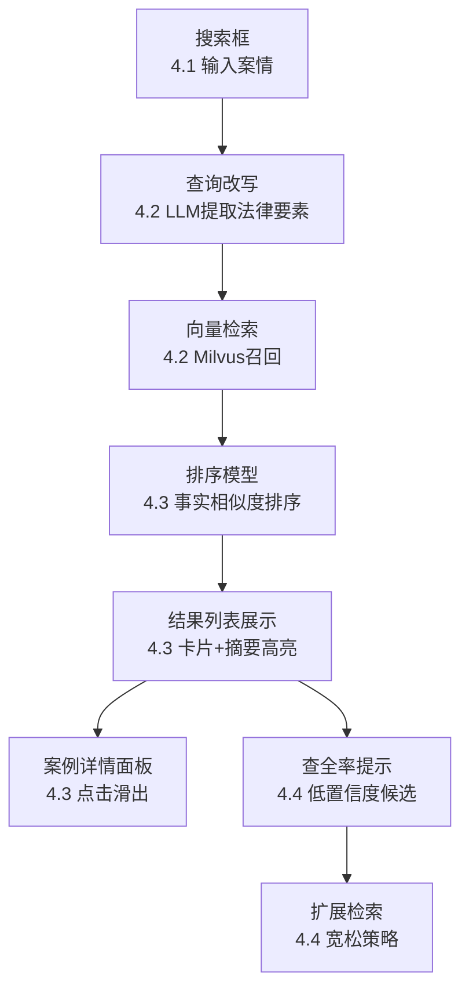

# 类案检索助手 MVP — 产品需求文档 (PRD)

| 属性 | 内容 |
|------|------|
| **产品名称** | 类案检索助手（暂定名） |
| **版本** | MVP v0.1 |
| **文档状态** | 初稿，待评审 |
| **目标用户** | 执业诉讼律师（3-8 年经验，民商事方向） |
| **核心价值** | 用口语化案情描述直接找到事实情节高度相似的裁判文书 |
| **开发周期** | 3 天（1 全栈工程师） |
| **技术栈** | React + TypeScript / Python FastAPI / DeepSeek API / RAG（LangChain + Milvus） |

---

## 阶段 1：执行摘要（5W1H）

**Who**：执业诉讼律师，特别是民商事纠纷领域 3-8 年经验的"判例猎人"——他们是所里默认的类案检索担当，每周至少 5 次类案检索。

**What**：一个基于 RAG（检索增强生成）的 Web 端法律类案检索工具。用户用 100-300 字口语化描述描述案情（如"被告在知道产品有质量缺陷的情况下继续销售，导致原告在使用中受伤"），系统自动进行语义理解，从裁判文书库中匹配事实情节高度相似的判例，并按相似度排序展示。

**Why**：现有法律检索工具（北大法宝、威科先行、Alpha）虽然已集成 AI 功能，但底层仍以关键词匹配为核心逻辑。律师检索时面临三大核心痛点：
1. **情节-关键词翻译损耗**：脑中完整的案件情节必须拆解为离散关键词，选词偏差导致漏掉高度相关判例
2. **相似度判断失准**：系统返回结果在关键词上相关，但事实情节相似度远不够
3. **假阴性焦虑**：永远不知道"是不是还有更相关的案例没搜到"

**Where**：Web 端，响应式适配移动端。

**When**：3 天 MVP 开发，第 1 天完成查询改写+RAG 检索链路，第 2 天完成前端搜索页+结果页，第 3 天联调+评测+上线。

**How**：用户输入口语化案情 → 系统进行查询改写（口语→法律要素提取+检索词扩展）→ RAG 检索引擎召回候选案例 → 排序模型按事实情节相似度排序 → 展示结果列表（标题+法院+审级+关键情节摘要+相似度评分）。

---

## 阶段 2：背景与目标

### 2.1 业务背景

法律类案检索是诉讼律师的核心日常工作。据用户调研，一位民商事诉讼律师每周平均进行 5-10 次类案检索，单次检索耗时 20-60 分钟。但现有工具的检索逻辑仍以"关键词匹配"为核心——用户必须把完整的案件情节拆解为离散关键词（如"明知、产品质量缺陷、继续销售、人身损害"），这一转译过程不仅耗时，更常因选词偏差导致漏掉高度相关但用词不同的判例。

你的调研发现，上一版本 MVP 留存率 0%——核心原因是"检索结果不准"。用户用自然语言描述案情后，系统返回的结果在事实情节上不匹配。

竞品格局方面：头号竞品 MetaLaw（秘塔）已用 AI 原生语义理解跑通了"讲案子直接找案例"的交互范式；Alpha 系统以"检索→报告→案件管理"的工作流闭环锁定了律所团队采购；但所有现有工具都尚未解决用户的"假阴性焦虑"——搜完了也不敢确定是不是搜全了。

### 2.2 核心假设（待验证）

| 编号 | 假设 | 置信度 | 对产品的影响 |
|:---:|------|:---:|------|
| H1 | 律师习惯用自然语言描述案情而非提炼关键词 | 需验证 | 若为真，搜索框应为 100-300 字开放性输入，而非关键词输入 |
| C2 | 检索效率瓶颈在"读和比"（从案例中提取信息）而非"找" | 高优先级验证 | 若为真，结果展示必须包含关键情节摘要，而非仅标题列表 |
| C1 | 痛点在于案例权威性/效力不足（法院层级、审级） | 中 | 若为真，排序需叠加权威性权重 |
| H5 | 用户只需要 3-5 个高相关案例，而非大量候选 | 需验证 | 若为真，结果页设计应以精准优先而非召回优先 |

### 2.3 产品目标（OKR）

**O**：验证"自然语言→高精准类案匹配"的技术可行性与用户价值

- **KR1**：Top10 命中率 ≥ 60%（用户主观判断检索结果中"事实情节高度相关"的案例占比，至少 5 人测试，每人对 3 组查询打分）
- **KR2**：单次检索耗时 ≤ 10 分钟（从打开工具到确认找到满意案例，对比当前 20-60 分钟基准）
- **KR3**：3 天内至少 5 名目标律师完成真实检索任务，其中 ≥ 3 人表示"愿意在正式工作中继续使用"

---

## 阶段 3：用户与场景

### 3.1 核心用户画像：「判例猎人王律」

| 维度 | 描述 |
|------|------|
| **画像名称** | 判例猎人王律 |
| **职业背景** | 执业 5-8 年诉讼律师，10-30 人中型律所，主攻民商事纠纷（侵权责任、合同纠纷等事实密集型案由）。年均承办 20-30 件，有争议案件均需类案检索 |
| **一句话标签** | 想把整个案情故事"讲"给搜索框听，然后直接看到相似判决书 |
| **典型引语** | "我跟检索系统说'一个人开车碰瓷被行车记录仪拍下来了'，它给我推荐了一堆交通事故赔偿标准的文书，可我真正要的是那种认定'故意制造事故'、判碰瓷者败诉甚至罚款的判决书啊。" |

**核心痛点（按严重程度排序）：**

1. **情节-关键词翻译损耗**：脑中完整案件情节必须拆解为离散关键词，选词偏差导致漏掉高度相关但用词不同的判例。
2. **相似度判断失准**：系统返回在关键词上相关，但事实情节相似度不足，须手动逐篇阅读筛选。
3. **检索策略无法复用**：每次新案件都需从头构建检索式，上周的检索经验本周无法迁移。

**行为特征：**
- 接到新案后，先在 Word 里用 3-4 句话把案件前因后果描述一遍，然后粘贴到检索框
- 面对搜索结果几乎不看案由标签，快速扫描标题寻找"情节动词"（如"碰瓷""诱骗""先……后……"）
- 在专业数据库搜不到时，会切换到微信/百度用同样大白话搜索，找到案号后再反向回数据库检索

**核心 JTBD：**

| Job 层次 | 具体 Job |
|:---:|------|
| 功能型（主要） | "当我接手一个涉及新业态或事实认定存在争议的案件时，我想要用一两段口语化的案情描述，直接搜到与本案情节和争议焦点高度相似的裁判文书，这样我就能避免在庭上被对方律师用更全的类案'突袭'。" |
| 功能型（次要） | "当我找到一个完美匹配的案例后，我想要一键查看该法院及上一级法院在同类问题上的裁判倾向。" |
| 情感型 | "我希望在使用检索工具时感到'一切尽在掌握'的确信感，而不是'搜完了也不敢确定是不是全了'的焦虑。" |

**决策逻辑：**
- 会付费使用：当工具前 10 条结果中有 ≥ 6 条在事实上高度类似，且能高亮展示两段事实的相似之处
- 会放弃使用：连续 3 次用自然语言描述案情，返回结果不如自己用关键词组合搜得准

### 3.2 核心使用场景

#### 场景 A：庭审前紧急检索（高频 / 关键）

**触发条件**：明天上午开庭，今晚需要确认是否有支撑己方主张的类案。

**User Journey**：
1. 打开类案检索助手 → 看到简洁搜索页
2. 在搜索框中输入约 200 字口语化案情描述（从已准备好的案情摘要中复制粘贴）→ 点击搜索
3. 看到骨架屏 loading（约 2 秒）→ 结果列表以卡片形式展示
4. 快速扫描每条结果标题 + 关键情节摘要（高亮与输入案情相似的部分）→ 找到 3 条高度相关案例
5. 点击案例标题 → 弹窗展示案例元数据（法院、审级、判决日期）+ 完整摘要
6. 确认 3 条案例均可用 → 复制案号记录到代理词中
7. 总耗时 < 8 分钟

**当前替代方案**：在 Alpha/北大法宝中用关键词组合搜索（"碰瓷 AND 故意 AND 交通事故"），反复调整关键词，逐篇阅读筛选，耗时 30-45 分钟。

**成功标准**：用户从输入到确认满意案例的耗时 < 10 分钟；Top10 结果中有 ≥ 6 条在事实上高度相关。

#### 场景 B：新型案件首次检索（中频 / 关键）

**触发条件**：接到涉及新业态（如区块链游戏道具侵权、AI 生成内容著作权）的案件，不知道该用什么关键词。

**User Journey**：
1. 打开类案检索助手 → 在搜索框中用 3-4 句大白话描述案情
2. 系统自动进行查询改写（提取法律要素 + 扩展同义法律术语）
3. 返回结果列表，每条展示相似度评分 + 关键情节摘要高亮
4. 用户浏览前几条，发现虽然案由不完全匹配，但事实情节相似度较高
5. 用户对其中 2 条满意 → 完成检索

**当前替代方案**：在微信群里问同行"有没有做过类似的案子"，再从回复中获取案号反向检索。

**成功标准**：即使用户输入完全不含法言法语（纯口语），系统仍能返回至少 3 条相关案例。

#### 场景 C：检索结果复核验证（中频 / 重要）

**触发条件**：已找到 3-5 条相关案例，但不确定是否遗漏了关键判例。

**User Journey**：
1. 用户看到当前搜索结果 → 底部出现"可能遗漏？扩展检索"入口
2. 点击扩展检索 → 系统以去掉部分限定条件的宽松策略重新检索
3. 返回一个"低置信度候选列表"（标注"以下案例与您的案情部分相关，但置信度较低"）
4. 用户快速扫视，确认没有遗漏关键案例 → 安心结束检索

**当前替代方案**：换一套完全不同的关键词重新搜，或者去另一个平台交叉验证。

**成功标准**：扩展检索功能使用后，用户主观"遗漏焦虑"降低（后续访谈验证）。

---

## 阶段 4：功能需求

### 功能 4.1：搜索框（P0）

**功能描述**：首页核心交互区域，提供一个大文本输入框，支持用户输入 100-300 字口语化案情描述。输入框内展示引导性 placeholder 文案，帮助用户理解"应该输入什么"。

**用户故事**：
作为 判例猎人王律，我想要 在搜索框中直接粘贴或输入一段约 200 字的口语化案情描述（无需拆解为关键词），以便 系统能理解案件情节并找到事实相似的判例，省去我手动提炼关键词的心智负担。

**交互逻辑**：
1. **默认态**：搜索框居中展示，placeholder 文案为："请输入案件基本情况，例如：被告在知道产品存在质量缺陷的情况下仍继续销售，导致原告在使用过程中受伤……"
2. **聚焦态**：点击搜索框 → 边框高亮为品牌色（深蓝），placeholder 保留，右下角显示字数统计（0/500）
3. **输入态**：用户输入文本 → 字数统计实时更新，超过 500 字时计数变红提示"建议精简至 500 字以内"
4. **提交态**：按 Enter 或点击搜索按钮 → 搜索按钮变为 loading 动画，输入框禁用，页面顶部显示进度条"正在理解您的案情……"
5. **完成态**：返回结果后，搜索框保留已输入内容（支持修改后重新搜索）

**边界条件**：
- 输入为空时 → 搜索按钮置灰不可点击，placeholder 闪烁提示
- 输入仅含标点或空格 → 视为空输入，同上处理
- 输入纯口语无法律事实（如"我觉得这个案子应该能赢"）→ 系统尝试检索，无结果时进入降级方案
- 输入超 500 字 → 不截断，但弱提示"建议精简"，用户仍可提交
- 用户输入内容涉及真实个人隐私信息（姓名、身份证号）→ 不在前端拦截，但后端不持久化原文（仅保留脱敏查询日志）

**功能间依赖**：
- 被 功能 4.2（查询改写）依赖 —— 搜索框提交后触发查询改写
- 被 功能 4.3（结果展示）依赖 —— 检索完成后由结果组件消费数据

---

### 功能 4.2：查询改写与 RAG 检索（P0）

**功能描述**：后端核心链路。接收用户输入的口语化案情描述 → LLM 进行查询改写（提取法律要素 + 扩展同义法律术语 + 生成多条检索变体）→ 对每条变体进行向量检索（在裁判文书向量库中搜索相似段落）→ 多路召回结果合并去重 → 传给排序模型。

**用户故事**：
作为 判例猎人王律，我想要 系统自动把我的大白话描述（如"一个人开车碰瓷被行车记录仪拍下来了"）翻译成法律语言并找到相关判例，以便 我不需要自己学会"碰瓷 = 故意制造事故 + 诈骗罪构成要件"这种转译。

**交互逻辑（后端，用户不可见）**：
1. 接收用户输入文本 → 首先进行基础清洗（去除多余空格、统一标点）
2. 调用 DeepSeek API 进行查询改写：
   - 提取法律要素（行为主体、行为动作、损害结果、行为性质）
   - 生成 2-3 条检索变体（原始口语版本 + 法言法语版本 + 扩展同义词版本）
   - 输出格式：`{"legal_elements": [...], "query_variants": ["变体1", "变体2", "变体3"]}`
3. 对每条检索变体 → 向量化 → Milvus 向量检索 → 召回 Top 50 候选案例
4. 多路召回结果合并去重（以案号唯一标识）
5. 将候选集传给排序模型（功能 4.3）

**边界条件**：
- LLM 查询改写超时（>5 秒）→ 降级为直接使用原始输入进行向量检索
- LLM 返回格式异常 → 同样降级为直接检索
- 向量检索召回数为 0（全部候选 < 3 条）→ 触发降级方案：用更宽松的检索参数（降低相似度阈值、增加召回量）
- 用户输入完全无法识别出法律要素（如纯情绪化抱怨）→ 返回提示"未能识别出案件关键信息，请尝试更具体地描述案件经过"

**性能指标**：
- 查询改写：P95 < 2 秒
- 向量检索：P95 < 1 秒
- 整体检索链路：P95 < 3 秒

**功能间依赖**：
- 依赖于 功能 4.1（搜索框）的输入
- 被 功能 4.3（结果展示）依赖 —— 检索结果传给前端渲染

---

### 功能 4.3：检索结果展示与排序（P0）

**功能描述**：前端核心页面。展示检索返回的案例列表，每个案例以卡片形式呈现关键信息，按"事实情节相似度"排序（非关键词命中数）。用户可点击卡片查看详情。

**用户故事**：
作为 判例猎人王律，我想要 搜索结果按事实情节相似度排序，每条结果展示标题、法院、审级、关键情节摘要（并高亮与我的案情相似的部分），以便 我不用逐篇打开 20 份判决书就能快速判断哪些案例真正值得细读。

**交互逻辑**：
1. **加载态**：搜索提交后 → 展示骨架屏（3 个灰色卡片占位，闪烁动画），搜索框上方显示进度文案"正在检索相似案例……"
2. **正常结果态**：结果以卡片列表形式展示，每张卡片包含：
   - 案例标题（18px 加粗，可点击）
   - 法院 + 审级 + 判决日期（12px 灰色）
   - 关键情节摘要（2-3 句，14px，与输入案情相似的关键短语高亮为品牌色背景）
   - 相似度评分条（右对齐，如"事实相似度 87%"）
   - 结果数量显示（如"共找到 28 条相关案例，按相似度排序"）
3. **点击案例**：展开案例详情面板（滑出或弹窗），展示：
   - 完整案号
   - 审理法院全称 + 审判程序
   - 完整案情摘要（5-8 句话）
   - 裁判要旨
   - "查看原文"链接（跳转至中国裁判文书网原文）
4. **滚动加载**：列表向下滚动 → 自动加载更多（每次加载 10 条），底部展示加载动画
5. **二次搜索**：用户修改搜索框内容 → 点击搜索 → 当前结果替换为新搜索结果，旧结果不缓存

**关键设计决策**：

| 决策点 | 选择 | 理由 |
|:---|------|------|
| 结果排序依据 | 事实情节相似度（向量匹配分数 × 法律要素重合度） | MoSCoW 确定本迭代唯一 Must 是精准度；权威性排序（法院层级等）延后到下一迭代 |
| 每页展示条数 | 10 条（滚动加载更多） | H5 假设用户只需要 3-5 条，但需保留"查看更多"的能力以缓解假阴性焦虑 |
| 摘要高亮 | 与输入案情相似的短语高亮 | 直接服务于 JTBD 次要 Job"快速读完核心逻辑"；竞品 Alpha/北大法宝均未做此功能 |

**边界条件**：
- 无结果：展示空状态页面——插画 + 文案"未找到匹配的案例，请尝试：① 扩展描述更多案件细节 ② 简化描述，聚焦核心事实 ③ 查看热门类案推荐" + 3 条热门案例推荐卡片
- 结果 < 5 条：正常展示，但底部展示"可能遗漏？"区域（见功能 4.4）
- 网络异常：结果列表顶部红色 Banner"网络连接失败，请检查网络后重试" + 重试按钮；已加载结果保留展示
- LLM 摘要生成失败：降级展示裁判文书原文前 200 字（标注"自动摘要生成失败，展示原文开头"）
- 结果超过 200 条：仅展示前 100 条，底部提示"已为您筛选前 100 条最相关结果"

**功能间依赖**：
- 依赖 功能 4.2（查询改写与 RAG 检索）的输出
- 依赖 功能 4.4（查全率与风险提示）的扩展检索功能
- 为后续迭代的功能（案例详情页、类案检索报告生成）提供基础

---

### 功能 4.4：查全率与风险提示（P1 / Should）

**功能描述**：缓解律师的"假阴性焦虑"——搜完了也不确定是不是搜全了。在搜索结果页底部提供扩展检索入口，以宽松策略检索并展示"低置信度候选列表"。

**用户故事**：
作为 判例猎人王律，我想要 在看完主要检索结果后，能快速确认"还有没有遗漏的关键案例"，以便 我带着确信感走进法庭，而不是"搜完了心里还是有个疙瘩"。

**交互逻辑**：
1. 结果列表底部展示分割线 + 模块标题"可能遗漏？"
2. 模块内展示 3-5 条"低置信度候选案例"——这些案例与输入案情的向量相似度处于边缘阈值（如 0.6-0.7），未进入主要结果列表
3. 每条低置信度候选案例以简化卡片展示（标题 + 法院 + 一行摘要）
4. 模块底部有"查看更多可能相关案例 →"链接，点击后以去掉部分限定条件（如降低相似度阈值、扩展案由范围）重新检索
5. 扩展检索结果以独立列表展示，顶部标注"以下案例与您的案情部分相关，但置信度较低，仅供参考"

**边界条件**：
- 主要结果 > 20 条时 → "可能遗漏？"模块不展示（结果已足够丰富，无需提示遗漏）
- 扩展检索仍无结果 → 展示"已尽量覆盖，未发现更多相关案例"
- 用户不点击扩展检索直接离开 → 不影响核心体验

**功能间依赖**：
- 依赖 功能 4.3（结果展示）的列表底部位置
- 调用 功能 4.2（RAG 检索）的宽松检索模式

---

### MVP 范围外（P2 / Won't — 预留扩展点）

以下功能在 MVP 阶段不做，但架构上预留扩展能力：

| 功能 | Won't 理由 | 复活条件 |
|------|-----------|---------|
| 关键词知识辅助 | 精准度未达标前投入，相当于给漏水的桶加装饰 | Top10 命中率稳定 > 65%，且用户反馈"不知道该怎么描述"占比 > 20% |
| AI 理解的可解释性 | 用户初期依赖"管用"远大于"透明"，解释一个不准的结果无意义 | 精准度达标后有律所因"黑箱"问题拒绝续费 |
| 类案检索报告一键生成 | 需先验证核心检索价值，报告是增值功能 | 核心检索使用频率稳定后作为留存提升手段 |
| 检索历史/收藏 | 单次检索体验未验证前，做长期功能无意义 | DAU 稳定后优先做"历史记录"降低重复输入负担 |
| 法官/法院倾向分析 | JTBD 自检指出这在高年资律师中才是刚需，MVP 优先覆盖 3-8 年经验律师 | 用户基础扩大且高级用户占比 > 30% |
| 移动端小程序 | 先验证 Web 端核心体验 | Web 端留存率达标后 |

---

## 阶段 5：非功能需求

### 5.1 性能需求

| 指标 | 目标值 | 测量方法 |
|------|:---:|------|
| 检索响应时间（P95） | < 3 秒 | 从用户提交搜索到首条结果渲染完毕 |
| 查询改写耗时（P95） | < 2 秒 | LLM API 调用耗时 |
| 向量检索耗时（P95） | < 1 秒 | Milvus search 耗时 |
| 页面首屏加载 | < 2 秒 | Lighthouse Performance Score > 90 |
| 并发检索支持 | 10 QPS | 3 天 MVP 阶段仅 1 人测试，降至 1 QPS 即可 |

### 5.2 安全与隐私

| 要求 | 实现方式 |
|------|------|
| 传输加密 | 全站 HTTPS |
| 用户输入数据 | 后端不持久化存储用户输入的案情原文；仅保留脱敏查询日志（时间戳 + 输入字符数 + 检索耗时 + 结果数量） |
| LLM API 调用 | 输入文本在发送至 DeepSeek API 前不做额外处理；需确认 DeepSeek API 的隐私政策是否声明"不将 API 输入用于模型训练" |
| 裁判文书数据 | 仅使用中国裁判文书网公开数据，数据源标注清晰，标注数据截止日期与更新频率 |

### 5.3 兼容性

| 环境 | 支持范围 |
|------|------|
| 浏览器 | Chrome 120+ / Firefox 120+ / Edge 120+ / Safari 17+ |
| 移动端 | iOS Safari / Android Chrome / 微信内置浏览器（响应式适配） |
| 屏幕尺寸 | 375px - 1440px（移动端优先设计） |

### 5.4 可用性

| 场景 | 预期行为 |
|------|------|
| 搜索过程中断网 | 已输入内容保留在搜索框中（不丢失），顶部展示网络异常提示。恢复连接后可重新提交 |
| 页面刷新 | 搜索框中已输入内容通过 localStorage 缓存，刷新后恢复 |
| 搜索结果页刷新 | 不缓存搜索结果（法律检索对数据时效性敏感），刷新后回到搜索页 |

---

## 阶段 6：交互与视觉

### 6.1 页面结构

```
类案检索助手
├── 搜索页（首页）
│   ├── 顶部：Logo + 产品名称
│   ├── 主体：搜索框（大文本输入）
│   └── 底部：使用提示（"试试这样描述：……" + 3 个示例，点击自动填入）
├── 搜索结果页
│   ├── 顶部：搜索框（保留已输入内容，支持修改）
│   ├── 主体：结果列表（卡片形式，滚动加载）
│   │   ├── 结果卡片（标题 + 元数据 + 情节摘要高亮 + 相似度评分条）
│   │   └── "可能遗漏？"模块（底部）
│   └── 无结果时：空状态页面 + 示例推荐
└── 案例详情面板（从结果列表点击滑出）
    ├── 案号 + 法院全称 + 审判程序
    ├── 完整案情摘要
    ├── 裁判要旨
    └── "查看原文"链接
```

### 6.2 状态覆盖

#### 搜索页

| 状态 | 描述 |
|------|------|
| 正常态 | 搜索框居中，placeholder 引导文案 |
| 聚焦态 | 边框高亮，字数统计出现 |
| 输入中 | 实时字数统计更新 |
| 超过字数建议 | 计数变红 + "建议精简"弱提示 |
| 提交中 | 搜索按钮 loading 动画，输入框禁用 |

#### 搜索结果页

| 状态 | 描述 |
|------|------|
| 加载态 | 骨架屏（3 个灰色卡片占位 + 闪烁动画） |
| 正常结果 | 卡片列表展示，滚动加载更多 |
| 加载更多 | 列表底部 loading spinner |
| 无结果 | 空状态插画 + 搜索建议 + 热门案例推荐 |
| 结果稀少（<5条） | 正常展示 + "可能遗漏？"模块 |
| 网络异常 | 顶部红色 Banner + 重试按钮，已加载结果保留 |
| 搜索到一半离开 App 再回来 | 当前页面状态保持不变 |

#### 案例详情面板

| 状态 | 描述 |
|------|------|
| 正常态 | 滑出面板，展示完整案例信息 |
| 加载中 | 骨架屏加载 |
| 原文链接不可达 | 链接置灰 + 提示"原文链接暂不可用" |

### 6.3 视觉设计约束

| 设计维度 | 规范 |
|------|------|
| 整体风格 | 专业、可信赖、简洁。参考法律行业常用的克制设计语言（非花哨、非娱乐化） |
| 主色调 | 深蓝 #1A365D（品牌色，传递专业与可信赖感） |
| 辅助色 | 深灰 #2D3748（正文）、中灰 #718096（次要信息）、浅灰 #EDF2F7（背景） |
| 高亮色 | 琥珀 #DD6B20（关键情节相似片段的高亮背景） |
| 字体 | 系统默认字体栈（-apple-system, BlinkMacSystemFont, "Segoe UI", "PingFang SC", "Microsoft YaHei"） |
| 卡片圆角 | 8px |
| 搜索框 | 高度 ≥ 120px（支持多行输入），字号 16px（避免移动端自动缩放） |
| 响应式 | 移动端（375px）为首要设计尺寸，桌面端（1024px+）搜索框居中、最大宽度 720px |

---

## 阶段 7：数据与埋点

### 7.1 核心指标定义

| 指标 | 定义 | MVP 目标 |
|------|------|:---:|
| 检索完成率 | 提交搜索 → 看到结果列表的比例 | > 95% |
| Top10 主观命中率 | 用户主观判断前 10 条中"事实高度相关"的占比 | ≥ 60% |
| 首次搜索成功率 | 用户无需修改搜索词就找到满意案例的比例 | ≥ 50% |
| 二次搜索率 | 首次搜索无满意结果后，修改搜索词再次搜索的比例 | < 40%（越低越好） |
| 平均检索耗时 | 从打开工具到确认找到满意案例的总耗时 | < 10 分钟 |

### 7.2 埋点事件表

| 事件名 | 触发时机 | 参数 |
|------|------|------|
| `search_submit` | 用户提交搜索 | `input_length`（输入字符数）、`has_legal_terms`（是否包含法言法语，布尔值）、`timestamp` |
| `search_rewrite_done` | 查询改写完成 | `variant_count`（检索变体数量）、`rewrite_duration_ms`（改写耗时）、`legal_elements_count`（提取的法律要素数） |
| `search_retrieval_done` | 向量检索完成 | `candidate_count`（召回候选数）、`retrieval_duration_ms`（检索耗时）、`result_count`（去重后结果数） |
| `search_result_render` | 搜索结果页面渲染完成 | `total_duration_ms`（从提交到渲染的总耗时）、`result_count`（展示结果数） |
| `result_card_click` | 用户点击结果卡片 | `result_rank`（排名位置）、`similarity_score`（相似度评分）、`card_interaction`（点击标题/点击摘要/点击详情） |
| `case_detail_view` | 用户查看案例详情 | `case_id`（案号，脱敏）、`view_duration_s`（停留秒数）、`scrolled_to_bottom`（是否滚动到底部） |
| `search_refine` | 用户修改搜索词再次提交 | `original_input_hash`（原始输入哈希）、`new_input_hash`（新输入哈希）、`refine_count`（第几次修改） |
| `search_zero_result` | 搜索无结果 | `input_length`、`fallback_triggered`（是否触发了降级方案）、`fallback_action`（用户后续行为：扩展检索/修改搜索/离开） |
| `extended_search_trigger` | 用户触发扩展检索 | `main_result_count`（主要结果数） |
| `page_exit` | 用户离开页面 | `session_duration_s`（会话时长）、`total_searches`（会话内搜索次数）、`has_satisfied_result`（是否找到满意案例，无法精确判断，暂用"最后点击的结果停留 > 30 秒"作为代理指标） |

---

## 阶段 8：验收标准

### 8.1 搜索框（功能 4.1）

**场景：正常输入案情搜索**
- Given 用户在搜索页
- When 用户输入 150 字口语化案情描述并按 Enter
- Then 搜索按钮变为 loading 动画，2 秒内跳转到搜索结果页，且搜索框中保留已输入文本

**场景：输入为空**
- Given 用户在搜索页且未输入任何内容
- When 用户点击搜索按钮
- Then 搜索按钮保持置灰不可点击状态，无任何请求发出

**场景：输入超长**
- Given 用户在搜索框中输入超过 500 字
- When 字数超过 500
- Then 字数统计变红显示"建议精简至 500 字以内"，但搜索按钮仍可点击（不阻断提交）

**场景：页面刷新后恢复输入**
- Given 用户输入了 200 字案情描述但未提交
- When 用户刷新页面
- Then 搜索框中恢复之前输入的 200 字内容

### 8.2 检索与排序（功能 4.2 + 4.3）

**场景：正常检索并展示结果**
- Given 用户输入了一段关于"被告明知产品有缺陷仍继续销售"的案情描述
- When 用户提交搜索
- Then 3 秒内展示结果列表，且前 5 条结果中至少有 3 条的事实情节与"明知产品缺陷 + 继续销售 + 造成损害"相关

**场景：检索无结果**
- Given 用户输入了一段完全无法匹配的文本（如"今天天气真好"）
- When 系统完成检索但返回 0 条结果
- Then 展示空状态页面，包含"未找到匹配案例"文案 + 3 条搜索建议 + 3 条热门案例推荐

**场景：检索无结果——降级方案**
- Given 主检索返回 0 条结果
- When 用户触发降级方案（如"查看热门案例推荐"）
- Then 展示 3 条热门案例推荐卡片，每条可点击查看详情

**场景：结果中关键情节高亮**
- Given 用户输入"被告在知道产品存在质量缺陷的情况下仍继续销售"
- When 搜索结果展示
- Then 结果摘要中与"知道""质量缺陷""继续销售"语义相似的短语以琥珀色高亮背景标注

**场景：网络异常重试**
- Given 用户已提交搜索但网络中断
- When 检索请求超时
- Then 结果区域展示红色 Banner"网络连接失败，请检查网络后重试" + 重试按钮；点击重试按钮 → 重新发起检索

**场景：摘要生成失败降级**
- Given 检索成功但 LLM 摘要生成接口异常
- When 系统无法生成关键情节摘要
- Then 每条结果展示裁判文书原文前 200 字，并标注"自动摘要生成失败，展示原文开头"

### 8.3 查全率与风险提示（功能 4.4）

**场景：结果稀少时展示"可能遗漏"模块**
- Given 主检索返回 4 条结果
- When 结果列表渲染完成
- Then 列表底部展示"可能遗漏？"模块，包含 3-5 条低置信度候选案例

**场景：结果充足时不展示"可能遗漏"模块**
- Given 主检索返回 25 条结果
- When 结果列表渲染完成
- Then "可能遗漏？"模块不展示

**场景：扩展检索**
- Given 用户看到了"可能遗漏？"模块
- When 用户点击"查看更多可能相关案例 →"
- Then 触发宽松策略检索，新结果以独立列表展示，顶部标注"以下案例与您的案情部分相关，置信度较低"

---

## 附录 A：竞品功能对比

| 功能维度 | 北大法宝 | 威科先行 | Alpha | MetaLaw（秘塔）| 本产品（规划） |
|:---|:---:|:---:|:---:|:---:|:---:|
| 自然语言输入 | ✓ | ✓ | ✓ | ✓（核心）| ✓（核心）|
| 语义理解（非关键词）| 部分 | 部分 | 部分 | ✓ | ✓（RAG 驱动）|
| 情节摘要高亮 | ✗ | ✗ | ✗ | ✗ | ✓（差异化）|
| 扩展检索/查全验证 | ✗ | ✗ | ✗ | ✗ | ✓（差异化）|
| 类案报告生成 | ✓ | ✓ | ✓ | ✗ | MVP 不做 |
| 数据库覆盖 | 最全 | 全 | 中 | 中（增长中）| MVP 有限 |

---

## 附录 B：Mermaid 功能依赖图



---

## 附录 C：MVP 不做但预留扩展点的功能

| 功能 | 预留方式 |
|------|------|
| 检索历史 | 搜索输入已通过 localStorage 缓存单次草稿，扩展到历史列表只需改存储层 |
| 案例收藏 | 结果卡片数据结构预留 `is_favorited` 字段 |
| 类案报告生成 | 案例详情面板已包含摘要+裁判要旨，报告生成可复用此数据 |
| 法官/法院倾向分析 | 案例元数据已包含法院+审级字段，聚合分析可基于此扩展 |
| 移动端小程序 | 前端使用响应式设计，组件化架构，迁移小程序成本可控 |

---

_文档状态：初稿完成，待评审。标注【需确认】的推断需在评审会上逐项核实。_
