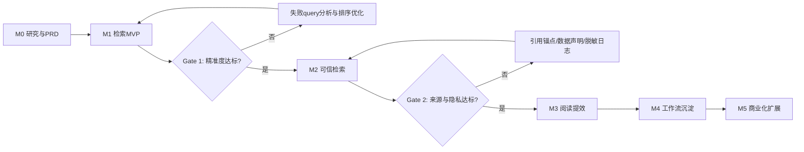

# 演进计划总览

## 1. 产品演进原则

类案检索助手的核心矛盾不是「有没有 AI 功能」，而是法律用户是否能在真实案件中更快找到可用类案，并相信结果没有明显遗漏。现有材料中，上一版 MVP 留存为 0% 的根因被归纳为「检索结果不准」。因此演进计划必须围绕一个顺序展开：

1. 先让用户找到事实相似的案例。
2. 再让用户理解为什么这些案例相似。
3. 再帮助用户确认是否还有可能遗漏。
4. 最后把检索结果沉淀为报告、收藏、团队知识库。

任何不能直接提升这四件事的需求，都不进入早期主路径。

## 2. 阶段路线图

| 阶段 | 版本目标 | 核心交付 | 成功指标 | 不做事项 |
| --- | --- | --- | --- | --- |
| M0 研究与原型 | 明确用户、场景、痛点与风险 | 用户画像、PRD、需求优先级、竞品分析、Sprint 计划 | 已完成文档闭环 | 不进入开发 |
| M1 检索 MVP | 验证「自然语言案情 -> 高相似类案」可行 | 搜索框、查询改写、RAG 检索、排序、结果列表、详情面板、基础埋点 | Top10 主观命中率 >= 60%；P95 检索链路 < 3s | 报告生成、协作、复杂画像 |
| M2 可信检索 | 缓解「AI 黑箱」和「漏案」焦虑 | 来源引用、数据覆盖声明、低置信度候选、扩展检索、回滚机制 | 扩展检索使用后，用户主观遗漏焦虑下降；生成内容 100% 有来源锚点 | 自动承诺查全率 |
| M3 阅读提效 | 从「找到」升级到「快速判断能不能用」 | 裁判要旨摘要、关键事实比对、相似片段高亮、案例对比 | 单篇案例判断时间下降 50%；详情页停留与收藏率上升 | 自动起草代理词 |
| M4 工作流沉淀 | 支持反复使用和团队复用 | 历史、收藏、导出、类案清单、轻量报告 | 7 日复访率、收藏/导出率提升 | 大而全案件管理 |
| M5 商业化扩展 | 面向律所采购与专业场景 | 团队空间、权限、批量导入、法院/法官倾向分析 | 付费转化、团队激活、续费意愿 | 分散到低频炫技功能 |

## 3. MVP 范围

### Must

| 能力 | 范围 |
| --- | --- |
| 自然语言案情输入 | 100-300 字为主要输入形态；支持最多 500 字弱提示 |
| 查询改写 | 提取法律要素，生成 2-3 条检索变体；失败时降级为原文检索 |
| 语义召回 | 使用向量检索召回候选案例，支持多路召回、去重 |
| 事实相似度排序 | 以事实相似度为主，案由和法律要素为辅，不让权威性覆盖事实匹配 |
| 结果展示 | 标题、法院、审级、日期、摘要、相似度、关键片段高亮 |
| 案例详情 | 案号、法院、审级、完整摘要、裁判要旨、原文链接 |
| 埋点与评测 | 搜索、改写、检索、渲染、点击、二次搜索、无结果、退出事件 |

### Should

| 能力 | 触发条件 |
| --- | --- |
| 扩展检索与低置信度候选 | 主结果少于 5 条，或用户主动点击「查看更多可能相关案例」 |
| 来源引用和数据覆盖声明 | 任何 AI 摘要、裁判要旨或高亮解释开始出现时必须同步支持 |
| 结果稀少时的引导 | 展示搜索建议、热门案例、扩展检索入口 |

### Won't

| 能力 | 暂不做原因 | 复活条件 |
| --- | --- | --- |
| 复杂关键词知识辅助 | 精准度未达标前，辅助功能不能解决核心流失 | Top10 命中率稳定 > 65%，且用户反馈「不知道怎么描述」占比 > 20% |
| 完整类案报告生成 | 工作流价值建立在检索可信之上 | 检索使用频次稳定，收藏/导出行为明显 |
| 多用户画像模式 | 早期分层会稀释核心体验 | 用户规模足够，行为分群稳定 |
| 法官/法院倾向分析 | 数据治理和统计解释要求更高 | 高年资用户占比上升，且明确愿为分析能力付费 |

## 4. 指标门禁

### Gate 0：数据与评测准备

进入开发前必须满足：

- 至少 20 条典型 query 评测样本。
- 至少 10 条含标准答案或人工相关性标注的 query。
- 至少 15 组高置信度法律术语映射或兜底映射对。
- 明确数据覆盖范围、裁判文书来源和更新时间。

未满足时，MVP 可以开发界面和接口骨架，但不得宣称检索质量达标。

### Gate 1：MVP 可用

上线内测前必须满足：

| 指标 | 门槛 |
| --- | --- |
| Top10 主观命中率 | >= 60% |
| Precision@5 | 不低于基线，目标提升 >= 10% |
| P95 检索链路 | < 3s |
| 搜索完成率 | > 95% |
| 无结果降级 | 100% 覆盖 |
| 回滚能力 | 排序规则可一键回到基线 |

### Gate 2：可信检索

进入 M2 前必须满足：

- 结果卡片、详情和摘要中的生成内容都有来源锚点。
- 用户原始案情不持久化，日志只保存脱敏字段。
- 扩展检索不会用「已查全」「保证无遗漏」等绝对话术。
- 能区分高置信度主结果和低置信度候选。

### Gate 3：工作流扩展

进入 M4 前必须满足：

- 检索成功率和复访率已验证。
- 收藏、复制案号、查看详情等行为显著存在。
- 用户明确有重复检索或复用类案清单的行为证据。

## 5. 版本节奏建议

### 第 1 个短周期：3 天 MVP

目标：跑通端到端链路，建立评测和回滚基础。

- Day 0：数据预筛、兜底映射、环境准备。
- Day 1：查询改写、向量召回、排序接口。
- Day 2：搜索页、结果页、详情面板、前后端联调。
- Day 3：评测、埋点、灰度、回滚演练。

### 第 2 个短周期：精准度优化

目标：从「能搜」变成「明显比关键词更懂案情」。

- 失败 query 聚类。
- 法律术语映射扩充。
- 案由加权、本院查明段落加权。
- NDCG@10、Precision@5、点击率和二次搜索率跟踪。

### 第 3 个短周期：可信与查全

目标：解决用户「结果看起来不错，但我不敢信」的问题。

- 数据覆盖声明。
- 来源引用锚点。
- 低置信度候选。
- 扩展检索。
- 负面案例与不利风险提示的雏形。

### 第 4 个短周期：阅读提效

目标：减少逐篇打开文书筛选的时间。

- 裁判要旨摘要。
- 事实相似点对比。
- 关键段落定位。
- 复制案号、导出类案清单。

## 6. 风险与降级策略

| 风险 | 早期信号 | 降级策略 |
| --- | --- | --- |
| 失败日志质量差 | 有效失败 query < 15 条 | 使用专家兜底映射与人工评测集，不强行数据驱动 |
| 术语映射不准 | 评测中相关案例被压低 | 映射表设置信心等级，低信心映射只扩展不加权 |
| 向量检索不准 | Top10 多为案由相关但事实不相关 | 混合 BM25、法律要素重合度、段落类型权重 |
| LLM 超时或格式错误 | 改写接口 P95 > 2s 或 JSON 解析失败 | 原始输入直接检索；记录降级事件 |
| 评测结论不显著 | NDCG@10 提升 < 0.02 | 不启用新排序规则，只上线日志和评测基线 |
| 用户焦虑漏案 | 主要结果少但用户不满意 | 提前开放低置信度候选，但不承诺查全 |

## 7. 关键取舍

### 不要把「自然语言输入」当成单独价值

用户愿意尝试自然语言，是因为它可能更快找到事实相似案例。如果结果不准，自然语言输入会反而放大失望。因此自然语言入口必须和查询改写、召回、排序一起验收。

### 不要过早做大工作流

Alpha 的优势是工作流闭环，但当前产品的机会是语义级类案匹配。报告、团队、案件管理只有在检索可信后才有意义。

### 不要承诺绝对查全

法律场景不能用「查全率 99%」这类不可验证承诺。更稳妥的表达是：展示数据覆盖、检索策略、低置信度候选和可能遗漏的风险维度，把判断权交还给律师。

## 8. 演进路线图

