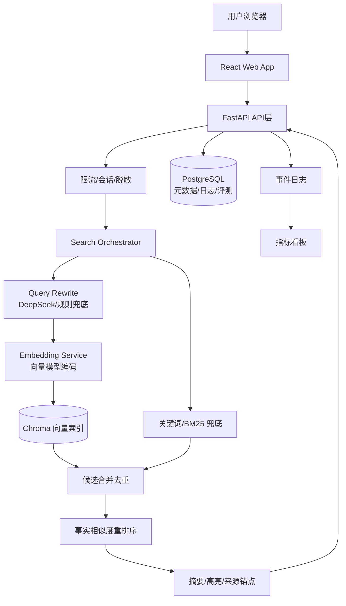
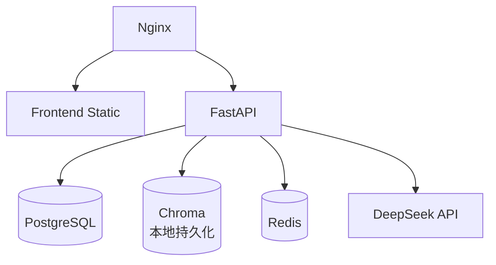

# 技术选型与架构设计

## 1. 设计目标

技术架构必须服务三个目标：

1. 快速验证：3 天内可以跑通自然语言检索到结果展示的端到端 MVP。
2. 可评测：每一次查询改写、召回、排序、摘要都能留下可分析的脱敏日志。
3. 可回滚：查询改写、权重、重排序和摘要都能通过配置关闭或回到基线。

## 2. 推荐技术栈

| 层级 | 推荐方案 | 选择理由 | MVP 降级 |
| --- | --- | --- | --- |
| 前端 | React + TypeScript + Vite | 当前 PRD 已指定 React/TS；Vite 对单页工具启动快、复杂度低 | 单页静态构建 |
| 样式 | Tailwind CSS + 设计 Token | 适合快速搭建一致界面，便于组件化约束 | CSS Modules |
| 后端 API | Python FastAPI | 与 LangChain、向量库、LLM SDK 生态匹配；接口开发快 | 单体 FastAPI |
| RAG 编排 | LangChain | 快速组织查询改写、检索、重排序、摘要链路 | 手写轻量 pipeline |
| LLM | DeepSeek API | PRD 指定；适合查询改写和摘要生成 | 规则映射 + 原文检索 |
| 向量模型 | 本地 bge-m3（Ollama 部署） | 中文长文本能力强，1024 维固定；本地推理免 API、数据不出本机；经 Ollama 暴露 embedding 接口，纯 CPU 也可跑 | 云端 API（如 Qwen3 Embedding / DashScope）按成本或并发需求再评估 |
| 向量库 | Chroma | 本地原型和小规模 Demo 上手最快，几乎零运维 | 数据规模或并发上来后迁 Milvus/Qdrant/pgvector |
| 结构化库 | PostgreSQL | 存案例元数据、搜索会话、埋点、评测集 | SQLite 原型 |
| 缓存 | Redis | 缓存 query embedding、热门 query 和短期任务状态 | 进程内缓存 |
| 部署 | Docker Compose + Chroma 本地持久化目录 | 前后端、数据库和向量索引可重复启动 | 单机部署 |
| 观测 | OpenTelemetry + 结构化日志 | 查询链路耗时和失败原因可追踪 | JSON 日志文件 |

### 2.1 向量模型与向量库的区别

RAG 必须同时有向量模型和向量库，二者职责不同：

| 组件 | 作用 | 类比 |
| --- | --- | --- |
| 向量模型 | 把案情描述、裁判文书片段编码成 embedding 向量 | 把文本翻译成可计算的语义坐标 |
| 向量库 | 存储 embedding，并根据向量相似度快速召回候选文书 | 在语义坐标系里找最近邻 |

Chroma、Milvus、Qdrant 这类向量库都不是向量模型，它们只负责存储和检索向量。没有 embedding 模型，向量库没有可检索的向量；没有向量库或类似索引，向量模型输出也难以在大量文书中高效查询。

### 2.2 向量模型选型要求

MVP 阶段先选「能稳定支持中文长文本语义检索」的 embedding 模型，不建议一开始就训练自有模型。

| 要求 | 说明 |
| --- | --- |
| 中文语义能力 | 能处理口语化案情和法言法语之间的表达差异 |
| 长文本适配 | 支持长上下文（bge-m3 上限 8192 token），完整裁判文书段落可整段编码，减少切碎导致的语义割裂 |
| 向量维度固定 | 便于 Chroma collection schema 固定和版本管理（bge-m3 固定 1024 维） |
| 本地可部署 | 经 Ollama / llama.cpp 本地推理，纯 CPU 亦可运行，数据不出本机；无需 API 配额和外网依赖 |
| 可替换 | 模型名称、维度、归一化策略、版本必须写入配置 |
| 可评测 | 每次替换模型必须跑同一套 Precision@5、NDCG@10 评测 |

建议分阶段：

| 阶段 | 策略 |
| --- | --- |
| MVP | 使用本地 bge-m3（Ollama 部署），跑通中文长文本召回链路，数据不出本机 |
| 精准度优化 | 对比 bge-m3、其他本地小尺寸模型、云端 Embedding API（如 Qwen3 / DashScope）和混合 BM25 的效果 |
| 数据沉淀后 | 基于 bad case 和人工标注，评估是否微调法律领域向量模型 |

环境变量配置建议：

| 环境变量 | 用途 | 当前状态 |
| --- | --- | --- |
| `EMBEDDING_PROVIDER` | 标记 provider，本地部署用 `ollama` | 默认 `ollama` |
| `EMBEDDING_MODEL` | 显式指定 embedding 模型名，如 `bge-m3` | 默认 `bge-m3` |
| `OLLAMA_BASE_URL` | 本地 Ollama 服务地址 | 默认 `http://localhost:11434` |

实现要求：

- 启动时校验本地 Ollama 服务可达（`OLLAMA_BASE_URL`），不依赖任何外部 API 密钥。
- 首次调用 embedding 后，记录返回向量维度（bge-m3 应为 1024），并与 Chroma collection 元数据校验。
- query embedding 和文书 chunk embedding 必须来自同一 provider、同一模型名、同一维度。
- embedding 服务不可用时记录降级原因；Demo 可临时降级到 BM25，但不能宣称 RAG 语义召回可用。

### 2.3 Demo 阶段向量库选择

Demo 阶段建议使用 Chroma，而不是 Milvus。

| 维度 | Chroma | Milvus |
| --- | --- | --- |
| 上手成本 | 极低，本地几行代码即可跑 | 偏高，组件和部署更重 |
| 适合规模 | 几万到几十万 chunk 的 Demo/原型 | 千万级以上或生产级大规模 |
| 运维 | 基本无运维 | 需要服务部署、资源和监控 |
| 过滤能力 | 支持基础 metadata 过滤 | 更强 |
| 生产成熟度 | 一般，适合早期 | 更成熟，适合规模化 |

当前项目 Demo 目标是验证「自然语言案情 -> 相似类案」链路，而不是验证大规模向量基础设施。Chroma 更符合轻量阶段，后续只要封装好 `VectorStore` 接口，就能迁移到 Milvus、Qdrant 或 pgvector。

## 3. 总体架构



## 4. 服务边界

MVP 先采用单体 FastAPI，内部按模块分层。后续当数据处理或评测任务变重时，再拆为独立服务。

| 模块 | 职责 |
| --- | --- |
| `api` | HTTP 接口、请求校验、错误返回、限流 |
| `query_rewrite` | 清洗用户输入、提取法律要素、生成检索变体、格式校验 |
| `retrieval` | 向量召回、关键词召回、元数据过滤、扩展检索策略 |
| `rerank` | 法律要素重合、案由加权、段落类型加权、最终分数融合 |
| `case_store` | 案例元数据、详情、原文链接、数据覆盖信息 |
| `highlight` | 相似片段定位、高亮范围生成 |
| `summary` | 关键事实摘要、裁判要旨、引用锚点 |
| `analytics` | 搜索、点击、二次搜索、错误、耗时等脱敏事件 |
| `eval` | 离线评测集、人工标注、NDCG/Precision 计算 |
| `feature_flags` | 排序规则、扩展检索、摘要生成等开关 |

## 5. 核心检索链路

### 5.1 请求处理

1. 前端提交案情描述。
2. API 校验文本长度、空白、纯标点。
3. 生成 `query_session_id` 和 `input_hash`。
4. 原始输入只进入本次检索链路，不持久化。
5. 记录脱敏日志：输入长度、请求时间、客户端类型。

### 5.2 查询改写

DeepSeek 返回结构化 JSON：

```json
{
  "legal_elements": [
    {"type": "actor", "value": "销售者"},
    {"type": "action", "value": "明知缺陷仍继续销售"},
    {"type": "damage", "value": "消费者受伤"}
  ],
  "query_variants": [
    "被告明知产品存在质量缺陷仍继续销售导致损害",
    "产品责任纠纷 明知缺陷 继续销售 人身损害",
    "销售者 未尽安全保障义务 产品缺陷 损害赔偿"
  ],
  "case_cause_hints": ["产品责任纠纷", "侵权责任纠纷"]
}
```

降级规则：

- LLM 超时：直接使用原始输入。
- JSON 解析失败：直接使用原始输入，并记录 `rewrite_failed`。
- 法律要素少于 2 个：继续检索，但结果页提示用户补充事实。

### 5.3 多路召回

| 召回路径 | 用途 | MVP 配置 |
| --- | --- | --- |
| 原文向量召回 | 保留用户原始表达中的事实相似度 | Top 50 |
| 法言法语变体召回 | 弥补口语和法律术语差异 | 每个变体 Top 30 |
| 案由过滤召回 | 提升同类法律关系命中 | 仅软过滤，不硬排除 |
| BM25 兜底 | 向量服务异常或精确词重要时补充 | Top 20 |

候选按 `case_id` 去重，保留最高召回分和命中的召回来源列表。

向量召回前置条件：

- 文书 chunk 已通过同一个向量模型完成 embedding。
- 用户 query 和改写 query 使用与索引一致的向量模型编码。
- embedding 维度、归一化方式、模型版本与 Chroma collection 元数据一致。
- 更换向量模型时必须重建索引或建立新 collection，不能混用不同模型生成的向量。

### 5.4 排序融合

MVP 排序公式建议：

```text
final_score =
  0.55 * vector_similarity
+ 0.20 * legal_element_overlap
+ 0.10 * case_cause_match
+ 0.10 * key_paragraph_match
+ 0.05 * authority_signal
```

约束：

- 事实相似度始终是主权重。
- 法院层级、审级、日期只作为辅助，不覆盖事实相似。
- 案由加权只做软提升，避免排挤「案由不同但事实模式高度相似」的案例。
- 所有权重通过配置文件控制，支持回滚到纯向量排序。

### 5.5 摘要与高亮

MVP 不依赖复杂生成即可展示结果：

1. 优先展示已抽取的关键段落。
2. 若摘要服务可用，生成 2-3 句关键情节摘要。
3. 每个摘要句子必须带 `source_chunk_id`。
4. 摘要失败时展示原文前 200 字，并标注「自动摘要暂不可用，展示原文片段」。

## 6. API 设计

### 6.1 搜索

`POST /api/search`

```json
{
  "query": "被告在知道产品存在质量缺陷的情况下仍继续销售，导致原告在使用过程中受伤。",
  "mode": "standard",
  "limit": 10
}
```

响应：

```json
{
  "query_session_id": "qs_20260601_001",
  "rewrite": {
    "legal_elements": ["明知缺陷", "继续销售", "造成损害"],
    "query_variants": ["产品责任纠纷 明知缺陷 继续销售 人身损害"],
    "degraded": false
  },
  "results": [
    {
      "case_id": "case_001",
      "title": "某某产品责任纠纷民事判决书",
      "case_no": "(2024)沪01民终1234号",
      "court": "上海市第一中级人民法院",
      "court_level": "中级人民法院",
      "trial_level": "二审",
      "judgment_date": "2024-05-18",
      "similarity_score": 0.87,
      "confidence": "high",
      "summary": "法院认定销售者明知涉案产品存在安全缺陷仍继续销售，最终支持消费者损害赔偿请求。",
      "highlights": [
        {"text": "明知产品存在安全隐患仍继续销售", "source_chunk_id": "chunk_001"}
      ],
      "source_url": "https://..."
    }
  ],
  "low_confidence_candidates": [],
  "coverage": {
    "data_until": "2026-05-01",
    "source": "公开裁判文书数据",
    "total_candidate_count": 128
  }
}
```

### 6.2 扩展检索

`POST /api/search/expand`

用途：降低相似度阈值、放宽案由限制、展示低置信度候选。

### 6.3 案例详情

`GET /api/cases/{case_id}`

返回案号、审理法院、审级、案由、全文片段、裁判要旨、引用来源、原文链接。

### 6.4 埋点

`POST /api/events`

只接收脱敏字段，不允许上传用户原始案情。

## 7. 错误与降级

| 场景 | 用户可见结果 | 系统动作 |
| --- | --- | --- |
| DeepSeek 超时 | 正常返回，但改写标记为降级 | 原始 query 直接向量召回 |
| 向量库不可用 | 提示「检索服务繁忙，已使用基础检索」 | BM25 兜底，记录告警 |
| 摘要失败 | 展示原文片段 | 关闭摘要链路，不影响结果 |
| 检索无结果 | 空状态 + 搜索建议 + 热门案例 | 执行宽松召回 |
| 排序规则异常 | 回到基线排序 | feature flag 自动关闭 |

## 8. 隐私与安全

| 风险 | 设计要求 |
| --- | --- |
| 用户输入含真实个人信息 | 不持久化原文；日志只保存 hash、长度、耗时和结果数量 |
| LLM API 数据使用 | 上线前确认 API 隐私条款；必要时对姓名、身份证、手机号做脱敏 |
| 编造案号或来源 | 所有生成内容必须绑定 `case_id` 和 `source_chunk_id` |
| 内部日志泄漏 | 日志分级，生产日志不包含原始 query 和全文 |
| 越权访问 | MVP 可无账号，但后台和数据导入必须鉴权 |

## 9. 观测指标

### 链路耗时

- `rewrite_duration_ms`
- `embedding_duration_ms`
- `retrieval_duration_ms`
- `rerank_duration_ms`
- `summary_duration_ms`
- `total_duration_ms`

### 质量指标

- `Precision@5`
- `NDCG@10`
- `Top10 主观命中率`
- `search_result_click_rate`
- `second_search_rate`
- `zero_result_rate`

### 稳定性指标

- LLM 超时率
- 向量库错误率
- API P95/P99
- 降级触发次数
- 回滚触发次数

## 10. 部署形态

### MVP 单机部署



### 后续扩展

- 数据导入和向量化拆成异步 worker。
- 摘要生成拆成队列任务，避免阻塞首屏结果。
- 评测平台独立，支持批量跑 query 和 A/B 对比。
- 按律所或团队隔离数据、配置和访问权限。

## 11. 技术债控制

| 决策 | 约束 |
| --- | --- |
| 先单体后拆服务 | 模块边界必须清晰，避免业务逻辑散在 API handler 中 |
| 先规则后模型训练 | 所有规则必须可配置、可评测、可回滚 |
| 先展示片段后生成摘要 | 摘要必须有来源，不允许无锚点生成 |
| 先日志后优化 | 没有评测和埋点，不上线排序改动 |
