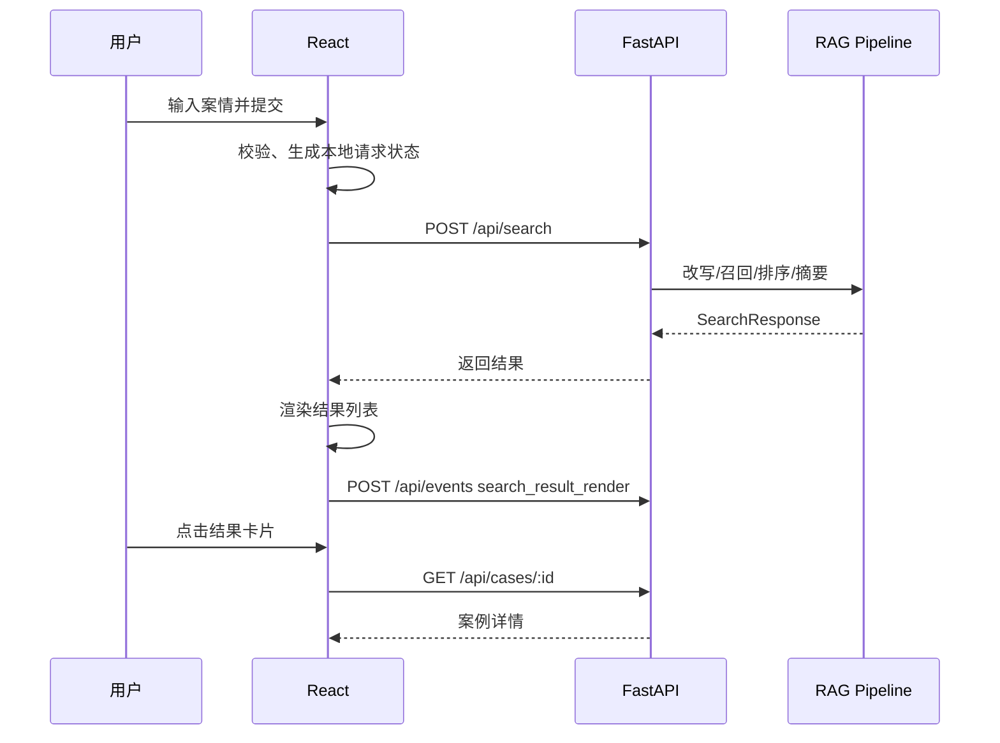

# 前端架构与设计系统

## 1. 前端目标

前端不是一个普通搜索页面，而是律师判断「这个案例能不能用于办案」的工作台。设计目标：

1. 输入轻：用户能直接粘贴口语化案情，不被复杂筛选打断。
2. 判断快：列表中即可看到事实摘要、相似度、法院、审级和关键高亮。
3. 信任足：明确区分主结果、低置信度候选、AI 摘要和原文引用。
4. 状态全：加载、空结果、网络异常、降级检索、摘要失败都有清晰反馈。

## 2. 技术选择

| 领域 | 推荐 |
| --- | --- |
| 框架 | React + TypeScript + Vite |
| 路由 | React Router |
| 数据请求 | TanStack Query |
| 表单状态 | React Hook Form 或组件内状态 |
| 全局状态 | 尽量不用；仅在需要跨页面保存搜索会话时使用 Zustand |
| 样式 | Tailwind CSS + CSS 变量 Token |
| 图标 | lucide-react，所有图标按钮必须有 tooltip 或 aria-label |
| 测试 | Vitest + React Testing Library + Playwright |

MVP 不建议使用复杂前端状态机。搜索流程本质是一次异步请求，加上结果列表和详情抽屉，使用 TanStack Query 管理服务端状态即可。

## 3. 页面结构

```text
/
├── 搜索首页
│   ├── 顶部品牌区
│   ├── 大文本搜索框
│   ├── 示例案情
│   └── 数据覆盖/隐私提示
├── /search?session=...
│   ├── 顶部紧凑搜索框
│   ├── 结果概览
│   ├── 结果列表
│   ├── 低置信度候选/可能遗漏
│   └── 案例详情抽屉
└── /case/:caseId
    └── 可选独立详情页，MVP 可暂不做
```

## 4. 信息架构

### 搜索首页

| 区域 | 内容 | 设计要求 |
| --- | --- | --- |
| 顶部 | Logo、产品名 | 克制，不做营销式大 Hero |
| 主输入 | 120px 以上多行文本框、字数统计、搜索按钮 | 聚焦态清晰；移动端字号 >= 16px |
| 示例 | 3 条典型案情，点击填入 | 示例必须来自真实高频场景：产品缺陷、碰瓷、合同履行 |
| 底部 | 数据覆盖、隐私说明 | 简短说明「不持久化保存原始案情」 |

### 搜索结果页

| 区域 | 内容 | 设计要求 |
| --- | --- | --- |
| 顶部搜索条 | 保留用户输入，可编辑后重搜 | 桌面端 sticky；移动端不遮挡内容 |
| 结果概览 | 找到数量、耗时、排序说明、数据覆盖 | 排序说明不可夸大，表达为「按事实相似度优先」 |
| 结果列表 | 结果卡片、相似度、摘要、高亮 | 主任务是扫读，不做过多装饰 |
| 详情抽屉 | 完整元数据、摘要、裁判要旨、原文链接 | 桌面右侧抽屉，移动端底部/全屏 |
| 可能遗漏 | 低置信度候选、扩展检索入口 | 只在结果少或用户触发时明显展示 |

## 5. 前端目录建议

```text
src/
├── app/
│   ├── App.tsx
│   ├── router.tsx
│   └── providers.tsx
├── pages/
│   ├── HomePage.tsx
│   └── SearchPage.tsx
├── components/
│   ├── search/
│   │   ├── SearchComposer.tsx
│   │   ├── QueryExamples.tsx
│   │   └── SearchProgress.tsx
│   ├── results/
│   │   ├── ResultOverview.tsx
│   │   ├── ResultList.tsx
│   │   ├── ResultCard.tsx
│   │   ├── SimilarityMeter.tsx
│   │   ├── HighlightText.tsx
│   │   └── LowConfidencePanel.tsx
│   ├── case-detail/
│   │   ├── CaseDetailDrawer.tsx
│   │   ├── CaseMetaBlock.tsx
│   │   ├── SourceAnchorList.tsx
│   │   └── JudgmentSummary.tsx
│   ├── feedback/
│   │   ├── EmptyResults.tsx
│   │   ├── ErrorBanner.tsx
│   │   └── ResultSkeleton.tsx
│   └── ui/
│       ├── Button.tsx
│       ├── Textarea.tsx
│       ├── Badge.tsx
│       ├── Drawer.tsx
│       └── Tooltip.tsx
├── hooks/
│   ├── useSearchCases.ts
│   ├── useCaseDetail.ts
│   └── useAnalytics.ts
├── services/
│   ├── apiClient.ts
│   ├── searchApi.ts
│   └── analyticsApi.ts
├── types/
│   ├── search.ts
│   ├── case.ts
│   └── analytics.ts
├── lib/
│   ├── format.ts
│   ├── validators.ts
│   └── storage.ts
└── styles/
    ├── globals.css
    └── tokens.css
```

## 6. 组件边界

### SearchComposer

职责：

- 输入案情描述。
- 字数统计。
- 空输入和纯标点校验。
- Enter/Ctrl+Enter 提交。
- localStorage 暂存未提交草稿。

不负责：

- 调用底层 RAG 细节。
- 展示结果列表。
- 保存搜索历史。

### ResultCard

职责：

- 展示标题、法院、审级、日期、案由。
- 展示事实摘要和高亮片段。
- 展示相似度。
- 触发详情查看事件。

不负责：

- 拉取案例详情。
- 判断排序逻辑。
- 展示完整文书。

### CaseDetailDrawer

职责：

- 拉取并展示案例详情。
- 区分 AI 摘要、原文片段、裁判要旨。
- 展示来源锚点和原文链接。

不负责：

- 修改检索条件。
- 生成报告。

### LowConfidencePanel

职责：

- 展示低置信度候选。
- 提供扩展检索入口。
- 明确提示「部分相关，仅供复核」。

不负责：

- 承诺查全。
- 替代主结果列表。

## 7. 前端数据类型

```ts
export type SearchMode = "standard" | "expanded";

export interface SearchRequest {
  query: string;
  mode: SearchMode;
  limit?: number;
}

export interface SearchResponse {
  query_session_id: string;
  rewrite: QueryRewrite;
  results: CaseSearchResult[];
  low_confidence_candidates: CaseSearchResult[];
  coverage: DataCoverage;
  degraded?: DegradedState;
}

export interface CaseSearchResult {
  case_id: string;
  title: string;
  case_no: string;
  court: string;
  court_level?: string;
  trial_level?: string;
  case_cause?: string;
  judgment_date?: string;
  similarity_score: number;
  confidence: "high" | "medium" | "low";
  summary: string;
  highlights: HighlightRange[];
  source_url?: string;
}

export interface HighlightRange {
  text: string;
  source_chunk_id: string;
}
```

## 8. 状态设计

### 搜索输入状态

| 状态 | 触发 | UI |
| --- | --- | --- |
| 默认 | 页面加载 | placeholder + 示例 |
| 聚焦 | 输入框 focus | 边框高亮、展示字数 |
| 输入中 | 有文本 | 搜索按钮可用 |
| 超长 | > 500 字 | 字数变为警示色，但不阻断提交 |
| 空输入 | 空白或纯标点 | 搜索按钮禁用 |
| 提交中 | 请求进行中 | 输入框禁用，按钮 loading |

### 结果状态

| 状态 | UI |
| --- | --- |
| 加载 | 3-5 个骨架卡片，进度文案「正在理解案情」 |
| 成功 | 结果概览 + 结果列表 |
| 结果少 | 正常列表 + 可能遗漏模块 |
| 无结果 | 空状态 + 修改建议 + 扩展检索 |
| 网络异常 | 顶部错误 Banner + 重试，保留输入 |
| 降级检索 | 轻提示「已使用基础检索策略」 |
| 摘要失败 | 卡片展示原文片段 |

### 详情状态

| 状态 | UI |
| --- | --- |
| 打开中 | 抽屉骨架屏 |
| 成功 | 元数据、摘要、裁判要旨、来源 |
| 原文不可达 | 链接置灰，展示原因 |
| 请求失败 | 错误提示和重试 |

## 9. 数据流



## 10. 响应式布局

| 断点 | 布局 |
| --- | --- |
| 375-767px | 单列；搜索框全宽；结果卡片纵向；详情用全屏抽屉 |
| 768-1023px | 单列居中；结果卡片最大宽度 760px |
| 1024px+ | 结果列表 + 右侧详情抽屉；主体最大宽度 1180px |
| 1440px+ | 主体最大宽度 1280px，避免行长过宽 |

约束：

- 不使用 `h-screen` 固定全屏高度，优先 `min-height: 100dvh`。
- 卡片、按钮、输入框尺寸稳定，hover 和 loading 不改变布局。
- 移动端详情抽屉不得遮住关闭按钮。

## 11. 可访问性

- 搜索框必须有可读 label，不能只靠 placeholder。
- 图标按钮必须有 `aria-label`。
- 相似度不能只用颜色表达，必须有文本。
- 高亮片段颜色对比度必须可读。
- 错误提示使用 `role="alert"`。
- 抽屉打开时焦点进入抽屉，关闭后回到触发卡片。

## 12. 前端埋点

| 事件 | 触发 | 前端参数 |
| --- | --- | --- |
| `search_submit` | 用户提交 | `input_length`, `trigger`, `has_draft_restored` |
| `search_result_render` | 结果渲染完成 | `result_count`, `total_duration_ms`, `degraded` |
| `result_card_click` | 点击卡片 | `case_id_hash`, `rank`, `similarity_score` |
| `case_detail_view` | 详情打开 | `case_id_hash`, `rank` |
| `search_refine` | 修改后重搜 | `refine_count`, `previous_result_count` |
| `extended_search_trigger` | 点击扩展检索 | `main_result_count` |
| `search_zero_result` | 无结果 | `input_length`, `fallback_available` |

前端不得上报原始案情文本。

## 13. 测试策略

| 类型 | 覆盖 |
| --- | --- |
| 单元测试 | 输入校验、字数统计、分数格式化、日期格式化 |
| 组件测试 | 搜索框状态、结果卡片、空状态、错误 Banner |
| 集成测试 | 搜索成功、无结果、网络失败、详情抽屉 |
| E2E | 首页输入 -> 结果列表 -> 点击详情 -> 扩展检索 |
| 视觉回归 | 375px、768px、1440px 三个视口 |

## 14. 前端 Definition of Done

- 所有 PRD 中列出的页面状态都有对应 UI。
- API 失败不会丢失用户输入。
- 搜索结果和详情页不展示未经来源绑定的生成内容。
- 移动端 375px 下无横向滚动。
- 核心按钮和输入可以键盘操作。
- 埋点不包含用户原文。

