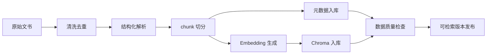

# 数据层设计

## 1. 数据层目标

类案检索的数据层要同时满足检索、可信、评测和隐私四类需求：

1. 检索：把裁判文书拆成适合语义召回的片段，并保留法院、案由、审级等元数据。
2. 可信：每条摘要、高亮和裁判要旨都能回到原文片段。
3. 评测：支持离线评估 Precision@5、NDCG@10 和人工相关性判断。
4. 隐私：用户原始案情不持久化，只保留脱敏行为指标。

## 2. 数据域

| 数据域 | 内容 | 存储 |
| --- | --- | --- |
| 案例原文 | 裁判文书全文、来源 URL、抓取时间 | 对象存储/文件系统 |
| 案例元数据 | 案号、标题、法院、审级、案由、日期、地域 | PostgreSQL |
| 文书片段 | 本院查明、本院认为、裁判结果、事实摘要等 chunk | PostgreSQL + Chroma |
| 向量模型配置 | embedding 模型名称、维度、版本、归一化策略 | PostgreSQL/配置文件 |
| 向量索引 | chunk embedding、元数据过滤字段 | Chroma |
| 术语映射 | 口语词、法律术语、案由提示、置信度 | PostgreSQL/JSON |
| 搜索会话 | session id、耗时、结果数、降级状态 | PostgreSQL |
| 行为事件 | 点击、详情、二次搜索、扩展检索、退出 | PostgreSQL/日志 |
| 评测集 | query、标准相关案例、人工打分、版本 | PostgreSQL |

## 3. 核心实体模型

### 3.1 CaseDocument

| 字段 | 类型 | 说明 |
| --- | --- | --- |
| `case_id` | string | 内部唯一 ID |
| `case_no` | string | 案号 |
| `title` | string | 文书标题 |
| `court` | string | 法院全称 |
| `court_level` | enum | 基层/中级/高级/最高 |
| `trial_level` | enum | 一审/二审/再审/执行等 |
| `case_cause` | string | 案由 |
| `judgment_date` | date | 裁判日期 |
| `region` | string | 地域 |
| `source_url` | string | 原文链接 |
| `source_name` | string | 数据来源 |
| `source_updated_at` | datetime | 数据更新时间 |
| `text_hash` | string | 原文 hash，用于去重 |
| `status` | enum | active/invalid/duplicate |

### 3.2 CaseChunk

| 字段 | 类型 | 说明 |
| --- | --- | --- |
| `chunk_id` | string | 片段 ID |
| `case_id` | string | 所属案例 |
| `chunk_type` | enum | fact/court_found/court_opinion/judgment_result/summary |
| `text` | text | 片段文本 |
| `start_offset` | int | 原文开始位置 |
| `end_offset` | int | 原文结束位置 |
| `embedding_id` | string | 向量索引 ID |
| `quality_score` | float | 片段质量分 |
| `created_at` | datetime | 创建时间 |

### 3.3 SearchSession

| 字段 | 类型 | 说明 |
| --- | --- | --- |
| `query_session_id` | string | 搜索会话 ID |
| `input_hash` | string | 用户输入 hash，不保存原文 |
| `input_length` | int | 输入字符数 |
| `rewrite_duration_ms` | int | 改写耗时 |
| `retrieval_duration_ms` | int | 召回耗时 |
| `rerank_duration_ms` | int | 排序耗时 |
| `summary_duration_ms` | int | 摘要耗时 |
| `total_duration_ms` | int | 总耗时 |
| `result_count` | int | 主结果数 |
| `candidate_count` | int | 候选数 |
| `degraded_reason` | string | 降级原因 |
| `created_at` | datetime | 创建时间 |

### 3.4 SearchResult

| 字段 | 类型 | 说明 |
| --- | --- | --- |
| `query_session_id` | string | 搜索会话 ID |
| `case_id` | string | 案例 ID |
| `rank` | int | 排名 |
| `final_score` | float | 最终分数 |
| `vector_score` | float | 向量分 |
| `legal_element_score` | float | 法律要素重合分 |
| `case_cause_score` | float | 案由分 |
| `paragraph_score` | float | 关键段落分 |
| `confidence` | enum | high/medium/low |
| `matched_chunk_ids` | array | 命中片段 |

### 3.5 EvaluationQuery

| 字段 | 类型 | 说明 |
| --- | --- | --- |
| `eval_query_id` | string | 评测 query ID |
| `query_text` | text | 可存储的公开/脱敏评测 query |
| `scenario` | string | 产品缺陷、碰瓷、合同履行等 |
| `expected_case_ids` | array | 标准答案案例 |
| `difficulty` | enum | easy/medium/hard |
| `source` | string | 专家构造/真实脱敏/用户访谈 |
| `version` | string | 评测集版本 |

### 3.6 EvaluationJudgment

| 字段 | 类型 | 说明 |
| --- | --- | --- |
| `eval_query_id` | string | query ID |
| `case_id` | string | 案例 ID |
| `relevance` | int | 0=无关，1=部分相关，2=高度相关 |
| `reason` | text | 人工判断理由 |
| `reviewer` | string | 标注人 |
| `created_at` | datetime | 标注时间 |

## 4. Chroma Collection 设计

Chroma collection 必须绑定一个明确的向量模型版本。不同模型生成的向量不能写入同一个 collection，否则相似度分数不可比较。

### Collection: `case_chunks_bge_m3_v1`

| 字段 | 类型 | 用途 |
| --- | --- | --- |
| `id` | string | Chroma document id，建议使用 `chunk_id` |
| `embedding` | float[] | 本地 bge-m3（Ollama）生成的向量，固定 1024 维 |
| `document` | text | chunk 文本，便于调试和回显 |
| `case_id` | string | 回表 |
| `chunk_id` | string | 来源定位 |
| `chunk_type` | string | 段落过滤/加权 |
| `case_cause` | string | 案由过滤 |
| `court_level` | string | 权威性信号 |
| `trial_level` | string | 审级信号 |
| `judgment_year` | int | 时间过滤 |
| `region` | string | 地域过滤 |
| `text_hash` | string | 去重 |

索引建议：

- MVP：使用 Chroma 默认 HNSW 索引，优先检索质量和调试便利。
- 数据量大后：迁移到 Milvus、Qdrant 或 pgvector，再按实际性能选择索引。
- 距离度量：优先 cosine。

### 4.1 EmbeddingModelVersion

| 字段 | 类型 | 说明 |
| --- | --- | --- |
| `embedding_model_id` | string | 向量模型版本 ID |
| `provider` | string | API 或本地模型提供方 |
| `model_name` | string | 模型名称 |
| `vector_dimension` | int | 向量维度 |
| `normalize` | boolean | 是否归一化 |
| `distance_metric` | enum | cosine/dot/l2 |
| `chunk_policy_version` | string | 对应切分策略版本 |
| `collection_name` | string | 对应 Chroma collection |
| `created_at` | datetime | 创建时间 |
| `status` | enum | active/testing/deprecated |

Demo 默认配置：

| 字段 | 建议值 |
| --- | --- |
| `provider` | `ollama` |
| `model_name` | `bge-m3`（本地 Ollama 部署） |
| `vector_dimension` | `1024`（bge-m3 固定；启动后由首次响应校验） |
| `collection_name` | `case_chunks_bge_m3_v1` |

向量模型替换流程：

1. 新建 `EmbeddingModelVersion`。
2. 使用同一文书 chunk 重新生成 embedding。
3. 写入新的 Chroma collection。
4. 跑同一套评测集，对比 Precision@5、NDCG@10、Top10 主观命中率。
5. 指标通过后切换 feature flag。
6. 保留旧 collection，直到线上稳定后再下线。

## 5. 文书切分策略

法律文书不能只按固定长度粗切。配合 bge-m3 的 8192 token 长上下文能力，推荐「结构识别 + 段落整段」，尽量保留完整语义单元：

1. 识别标题、案号、法院、案由、当事人、诉称、辩称、本院查明、本院认为、裁判结果。
2. 优先保留 `本院查明` 和 `本院认为`，因为这两类段落分别对应事实相似和裁判逻辑。
3. 以结构段落为切分单位，让 `本院查明`、`本院认为` 等整段进入一个 chunk；bge-m3 上限 8192 token，单段通常可整段编码而不被截断。
4. 仅当单段超出 8192 token 上限时才在段内二次切分，目标 1500-2500 中文字符，并保留 100-150 字重叠；不再为迁就短上下文模型而把段落切得过碎。
5. 每个 chunk 绑定原文 offset，方便高亮和引用回溯。

### chunk_type 规则

| 类型 | 来源段落 | 检索用途 |
| --- | --- | --- |
| `fact` | 当事人陈述、基本事实 | 事实相似度召回 |
| `court_found` | 本院查明/经审理查明 | MVP 高权重事实匹配 |
| `court_opinion` | 本院认为 | 裁判规则和争议焦点 |
| `judgment_result` | 判决如下/裁定如下 | 结果倾向 |
| `metadata_summary` | 结构化元数据摘要 | 快速兜底 |

## 6. 检索分数设计

### 6.1 候选级分数

```text
candidate_score =
  max_chunk_vector_score * 0.70
+ top3_chunk_avg_score * 0.15
+ matched_chunk_type_bonus * 0.15
```

### 6.2 案例级最终分数

```text
final_score =
  vector_similarity * 0.55
+ legal_element_overlap * 0.20
+ case_cause_match * 0.10
+ key_paragraph_match * 0.10
+ authority_signal * 0.05
```

### 6.3 置信度区间

| 置信度 | 条件 |
| --- | --- |
| high | `final_score >= 0.78` 且至少 2 个法律要素命中 |
| medium | `0.65 <= final_score < 0.78` |
| low | `0.55 <= final_score < 0.65`，仅进入低置信度候选 |

置信度只用于用户提示和候选分组，不作为法律结论。

## 7. 数据导入流水线



## 8. 数据质量门禁

| 检查项 | 门槛 |
| --- | --- |
| 案号缺失率 | < 2% |
| 法院缺失率 | < 2% |
| 裁判日期缺失率 | < 5% |
| chunk 空文本率 | < 1% |
| 重复文书率 | < 3% |
| `本院查明` 识别成功率 | MVP >= 60%，后续 >= 80% |
| embedding 成功率 | >= 99% |

## 9. 隐私与日志策略

### 不保存

- 用户原始案情描述。
- 可识别个人身份的信息。
- 未脱敏的手机号、身份证号、当事人姓名。

### 可以保存

- `input_hash`
- 输入长度。
- 是否包含法律术语。
- 检索耗时。
- 结果数量。
- 点击 rank。
- 案例 ID 的 hash。
- 降级原因。

### 保留周期

| 数据 | 周期 |
| --- | --- |
| 搜索会话脱敏日志 | 180 天 |
| 行为事件 | 180 天 |
| 评测集 | 长期保留 |
| 原始文书 | 按数据授权和来源政策保留 |
| 临时原始 query | 请求结束即释放 |

## 10. 评测集设计

### 样本组成

| 类型 | 数量 | 用途 |
| --- | --- | --- |
| 高频民商事 query | 10-20 | 验证主场景 |
| 失败 query 脱敏样本 | 10-20 | 验证优化效果 |
| 口语化 query | 10 | 验证查询改写 |
| 关键词 query | 10 | 防止传统检索退化 |
| 极端无效 query | 5 | 验证空状态和降级 |

### 指标

- Precision@5
- NDCG@10
- Top10 主观命中率
- 相关案例首次出现排名
- 二次搜索率
- 无结果率

## 11. 数据透明展示

前端需要展示的覆盖信息：

- 数据来源。
- 数据截止日期。
- 本次召回候选数量。
- 是否触发降级检索。
- 低置信度候选的说明。

禁止展示：

- 「已检索全部案例」。
- 「保证无遗漏」。
- 未经证实的数据总量。

## 12. 数据层 Definition of Done

- 每条结果可追溯到 `case_id` 和至少一个 `chunk_id`。
- 每条 AI 摘要句子有来源锚点或不展示。
- 用户原始 query 不落库。
- 搜索会话可用于链路耗时分析。
- 至少有一版可重复跑的评测集。
- 向量索引版本可回滚。
