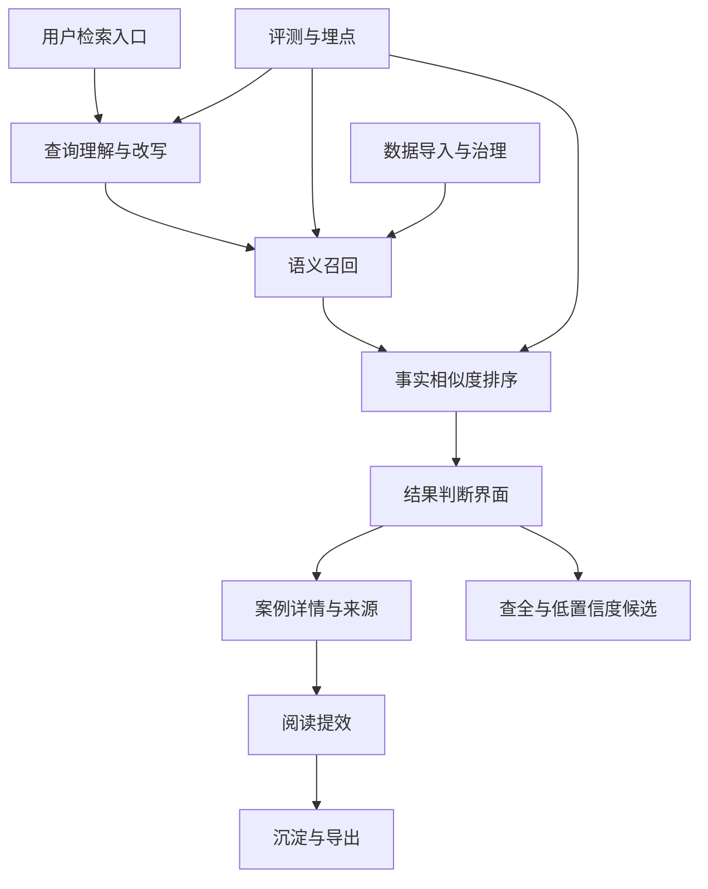
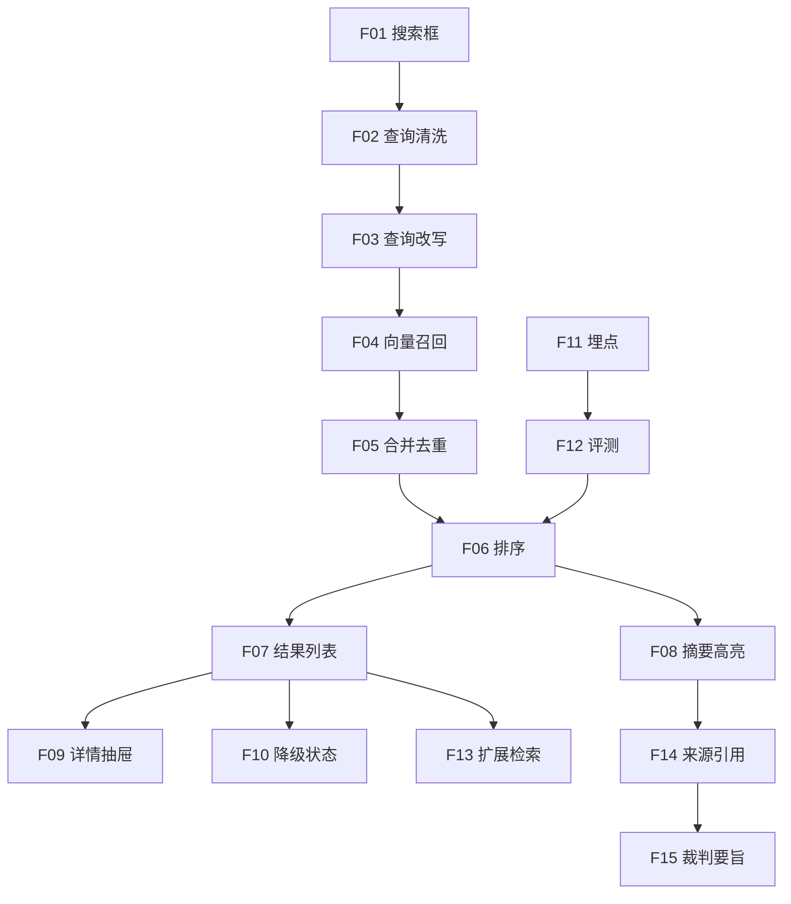

# 完整功能拆解

## 1. 功能分层

## 2. 优先级总表

| 编号 | 功能 | 优先级 | 研发类型 | 依赖 |
| --- | --- | --- | --- | --- |
| F01 | 自然语言搜索框 | P0 | 前端 | 无 |
| F02 | 查询清洗与校验 | P0 | 后端 | F01 |
| F03 | 查询改写 | P0 | 后端/LLM | F02 |
| F04 | 向量召回 | P0 | 后端/数据 | 数据导入 |
| F05 | 多路召回合并去重 | P0 | 后端 | F03, F04 |
| F06 | 事实相似度排序 | P0 | 后端/算法 | F05 |
| F07 | 搜索结果列表 | P0 | 前端 | F06 |
| F08 | 关键摘要与高亮 | P0 | 后端/前端 | F06, 文书 chunk |
| F09 | 案例详情抽屉 | P0 | 前端/后端 | F07 |
| F10 | 无结果与错误降级 | P0 | 前后端 | F03-F07 |
| F11 | 基础埋点 | P0 | 前后端 | F01-F09 |
| F12 | 评测集与离线评测 | P0 | 后端/测试 | F04-F06 |
| F13 | 扩展检索与低置信度候选 | P1 | 后端/前端 | F06, F07 |
| F14 | 来源引用与数据覆盖声明 | P1 | 后端/前端 | F08, 数据治理 |
| F15 | 裁判要旨摘要 | P1 | LLM/前端 | F14 |
| F16 | 检索历史草稿 | P1 | 前端 | F01 |
| F17 | 收藏与导出类案清单 | P2 | 前后端 | F09, 账号体系 |
| F18 | 类案报告生成 | P2 | 后端/LLM/前端 | F15, F17 |
| F19 | 法院/法官倾向分析 | P3 | 数据/算法 | 大规模结构化数据 |

## 3. P0 功能详解

### F01 自然语言搜索框

用户故事：作为诉讼律师，我希望直接输入一段案情描述，而不是先拆成关键词，以便系统理解事实经过并检索相似判例。

范围：

- 多行文本输入。
- placeholder 示例。
- 字数统计。
- 空输入禁用。
- 超过 500 字弱提示。
- 支持 Enter/Ctrl+Enter 提交。
- localStorage 保存未提交草稿。

验收标准：

- 空白、纯标点不能提交。
- 输入 150 字案情后可提交。
- 刷新页面后恢复未提交草稿。
- 移动端输入不触发页面缩放。

### F02 查询清洗与校验

范围：

- 去除多余空白。
- 统一中英文标点。
- 判断无效 query。
- 生成 `query_session_id` 和 `input_hash`。
- 不持久化原文。

验收标准：

- 纯空白返回 400。
- 合法输入进入检索链路。
- 日志只包含 hash、长度和耗时字段。

### F03 查询改写

用户故事：作为律师，我希望系统把「碰瓷」「不发货」「在职期间动手脚」这类口语表达转换为法律检索表达，减少漏检。

范围：

- 调用 DeepSeek 提取法律要素。
- 生成 2-3 条检索变体。
- 生成案由提示。
- JSON schema 校验。
- 超时或格式错误降级。

验收标准：

- 10 条典型 query 中，至少 8 条输出法律要素。
- LLM 超时时仍能用原 query 检索。
- 改写结果不删除原始关键事实。

### F04 向量召回

范围：

- 对原 query 和改写 query 生成 embedding。
- Chroma TopK 检索。
- 支持按案由、年份、段落类型软过滤。
- 返回 chunk 级候选。

验收标准：

- 检索 P95 < 1s。
- Chroma 异常时可触发 BM25 兜底。
- 每个候选包含 `case_id` 和 `chunk_id`。

### F05 多路召回合并去重

范围：

- 合并原文向量、改写向量、BM25 候选。
- 以 `case_id` 去重。
- 保留召回来源和最高 chunk 分。

验收标准：

- 同一案号不重复展示。
- 候选保留命中的 query variant。
- 候选数量不足时触发宽松召回。

### F06 事实相似度排序

范围：

- 向量分。
- 法律要素重合分。
- 案由加权。
- 关键段落加权。
- 权威性弱加权。
- 配置化权重和回滚。

验收标准：

- Precision@5 不低于基线。
- 评测集 NDCG@10 有正向提升。
- 排序规则可一键回到基线。
- 案由加权不能把事实明显不相关案例推入 Top3。

### F07 搜索结果列表

范围：

- 展示标题、法院、审级、日期、案由。
- 展示摘要、高亮、相似度。
- 展示结果数量和排序说明。
- 支持加载更多。

验收标准：

- 提交搜索后展示骨架屏。
- 有结果时列表完整渲染。
- 点击卡片打开详情。
- 375px 下无横向滚动。

### F08 关键摘要与高亮

范围：

- 展示 2-3 句事实摘要。
- 高亮与输入案情相似的短语。
- 摘要失败时展示原文片段。

验收标准：

- 高亮片段有来源 chunk。
- 摘要失败不影响结果展示。
- 高亮不遮挡文本阅读。

### F09 案例详情抽屉

范围：

- 案号、法院、审级、案由、日期。
- 完整摘要。
- 裁判要旨。
- 来源片段。
- 原文链接。

验收标准：

- 桌面端右侧抽屉。
- 移动端全屏抽屉。
- 原文链接不可用时展示降级说明。
- 关闭后焦点返回结果卡片。

### F10 无结果与错误降级

范围：

- 无结果空状态。
- 网络错误 Banner。
- LLM 降级提示。
- 摘要失败降级。
- 向量库异常兜底。

验收标准：

- 网络失败不清空输入。
- 无结果时给出修改建议和扩展检索入口。
- 降级检索有明确轻提示。

### F11 基础埋点

范围：

- `search_submit`
- `search_rewrite_done`
- `search_retrieval_done`
- `search_result_render`
- `result_card_click`
- `case_detail_view`
- `search_refine`
- `search_zero_result`
- `extended_search_trigger`
- `page_exit`

验收标准：

- 事件可在开发环境观测。
- 事件不包含原始 query。
- 每次搜索有统一 `query_session_id`。

### F12 评测集与离线评测

范围：

- 评测 query 管理。
- 人工相关性标注。
- Precision@5。
- NDCG@10。
- 版本对比。

验收标准：

- 至少 20 条评测 query。
- 支持基线和新规则对比。
- 输出 Markdown 或 CSV 评测报告。

## 4. P1 功能详解

### F13 扩展检索与低置信度候选

用户故事：作为律师，我希望在主结果较少时看到可能遗漏的候选案例，以便快速复核是否存在重要漏案。

范围：

- 主结果少于 5 条时展示候选。
- 点击扩展检索后放宽阈值。
- 独立展示低置信度列表。

验收标准：

- 主结果 > 20 条时默认不展示。
- 扩展结果有「部分相关」提示。
- 不使用「已查全」文案。

### F14 来源引用与数据覆盖声明

范围：

- 摘要句子绑定来源 chunk。
- 结果页展示数据截止日期。
- 详情页展示来源片段。

验收标准：

- 无来源的 AI 内容不展示。
- 数据覆盖信息可由 API 返回。
- 用户可从摘要定位到原文片段。

### F15 裁判要旨摘要

范围：

- 提炼裁判观点。
- 提炼关键争议焦点。
- 输出结构化摘要。

验收标准：

- 每条要旨有来源片段。
- 低置信度案例可以不生成要旨。
- 摘要失败时回退原文片段。

### F16 检索历史草稿

范围：

- 保存未提交草稿。
- 保存本会话最近一次搜索。
- 支持修改后重搜。

验收标准：

- 不保存原始 query 到后端。
- 本地历史可清除。

## 5. P2/P3 功能池

| 功能 | 做之前需要证明 |
| --- | --- |
| 收藏 | 用户频繁打开详情或复制案号 |
| 导出类案清单 | 用户在 3 条以上结果间比对 |
| 类案报告生成 | 用户已有明确交付物需求，且摘要可信 |
| 案例对比表 | 深度研析场景使用率足够 |
| 法院/法官倾向分析 | 数据覆盖、法院层级、法官字段质量达标 |
| 多用户模式 | 行为分群稳定且默认模式不能覆盖多数人 |

## 6. 内部后台功能

### 数据导入后台

- 上传/导入裁判文书。
- 查看解析成功率。
- 查看 chunk 类型分布。
- 触发 embedding 生成。

### 评测后台

- 管理评测 query。
- 查看基线与实验版本对比。
- 标记 bad case。
- 导出评测报告。

### 配置后台

- 排序权重。
- feature flag。
- 降级阈值。
- LLM prompt 版本。

MVP 可以先用配置文件和脚本替代后台 UI，但数据结构要预留。

## 7. 端到端用户故事

### 故事 A：庭审前紧急检索

1. 用户粘贴 200 字案情。
2. 系统 3 秒内返回结果。
3. 用户在前 10 条中看到至少 6 条事实相关。
4. 用户点击 3 条详情，复制案号。
5. 总耗时小于 10 分钟。

### 故事 B：新型案件首次检索

1. 用户输入不含法言法语的描述。
2. 系统完成查询改写。
3. 返回案由不完全相同但事实模式相似的案例。
4. 用户通过高亮片段判断可用性。

### 故事 C：复核是否遗漏

1. 用户看到主结果少于 5 条。
2. 页面展示低置信度候选。
3. 用户点击扩展检索。
4. 系统展示部分相关候选，并标注置信度较低。

## 8. 功能依赖图

## 9. 验收优先级

第一优先级：搜索链路可用、结果可展示、排序可评测、异常可降级。

第二优先级：来源可追溯、低置信度候选、摘要可用。

第三优先级：收藏、导出、报告、团队能力。
