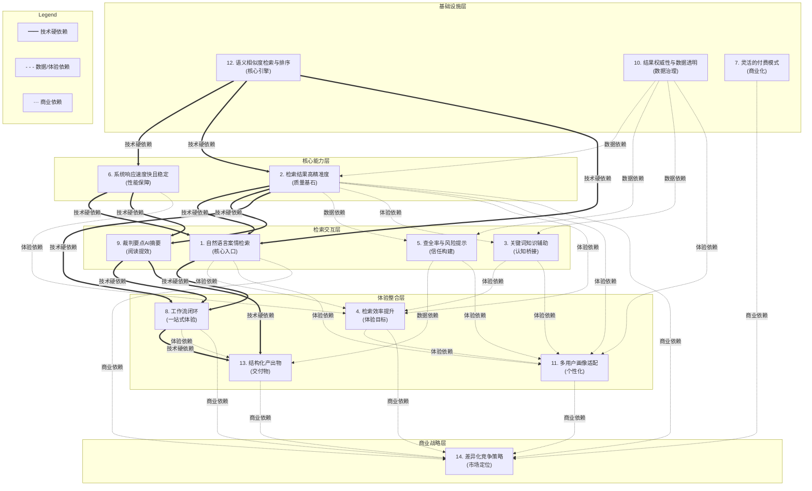

# 需求依赖关系分析

------

## 依赖关系表

| 需求编号 | 需求简述             | 前置需求              | 依赖类型            | 被谁依赖                     | 置信度 |
| -------- | -------------------- | --------------------- | ------------------- | ---------------------------- | ------ |
| 12       | 语义相似度检索与排序 | 无（底层引擎）        | 技术硬依赖          | 1, 2, 4, 5, 9, 13            | 高     |
| 10       | 结果权威性与数据透明 | 无（数据治理）        | 数据依赖            | 2, 5, 11                     | 高     |
| 6        | 系统响应速度快且稳定 | 12                    | 技术硬依赖          | 1, 4, 8, 9                   | 高     |
| 2        | 检索结果高精准度     | 12, 10                | 技术硬依赖+数据依赖 | 1, 3, 4, 5, 8, 9, 11, 13, 14 | 高     |
| 1        | 自然语言案情检索     | 12, 6, 2              | 技术硬依赖          | 4, 8, 11, 14                 | 高     |
| 3        | 关键词知识辅助       | 2, 10                 | 体验依赖+数据依赖   | 1, 4, 11                     | 中     |
| 5        | 查全率与风险提示     | 2, 10                 | 数据依赖+体验依赖   | 8, 11, 13                    | 高     |
| 9        | 裁判要点AI摘要与归纳 | 2, 6                  | 技术硬依赖          | 8, 13                        | 高     |
| 4        | 检索效率提升         | 1, 2, 3, 6            | 体验依赖            | 8, 11, 14                    | 中     |
| 8        | 工作流闭环           | 1, 2, 5, 9            | 体验依赖+技术硬依赖 | 13, 14                       | 中     |
| 13       | 检索后结构化产出物   | 8, 9, 5               | 技术硬依赖+体验依赖 | 14                           | 中     |
| 11       | 多用户画像与模式适配 | 1, 2, 3, 4, 5, 10     | 体验依赖            | 14                           | 低     |
| 7        | 灵活的付费模式       | 无                    | 商业依赖            | 14                           | 低     |
| 14       | 差异化竞争策略       | 1, 2, 4, 7, 8, 11, 13 | 商业依赖            | 无                           | 中     |

> **置信度说明**：
>
> - **高**：基于RAG系统架构的客观技术约束（如语义引擎是检索的前提、精准度是上层功能的基础）。
> - **中**：基于产品体验逻辑推断（如工作流闭环需要多个模块组合），但可通过MVP降级实现。
> - **低**：商业/运营层面依赖，与技术实现解耦，可随时调整。

------

## 依赖流程图

------

## 阻塞点排名

| 排名 | 阻塞需求                     | 直接阻塞数 | 间接阻塞数（含传递） | 总阻塞数 | 风险评级 |
| ---- | ---------------------------- | ---------- | -------------------- | -------- | -------- |
| 🥇 1  | **2. 检索结果高精准度**      | 9          | 4                    | **13**   | 🔴 致命   |
| 🥈 2  | **12. 语义相似度检索与排序** | 6          | 7                    | **13**   | 🔴 致命   |
| 🥉 3  | **6. 系统响应速度快且稳定**  | 4          | 5                    | **9**    | 🟠 高危   |
| 4    | **1. 自然语言案情检索**      | 4          | 4                    | **8**    | 🟠 高危   |
| 5    | **10. 结果权威性与数据透明** | 3          | 5                    | **8**    | 🟡 中危   |
| 6    | **8. 工作流闭环**            | 2          | 2                    | **4**    | 🟡 中危   |
| 7    | **9. 裁判要点AI摘要**        | 2          | 2                    | **4**    | 🟡 中危   |
| 8    | **5. 查全率与风险提示**      | 2          | 2                    | **4**    | 🟢 低危   |
| 9    | **3. 关键词知识辅助**        | 2          | 2                    | **4**    | 🟢 低危   |
| 10   | **4. 检索效率提升**          | 2          | 1                    | **3**    | 🟢 低危   |
| 11   | **7. 灵活付费模式**          | 1          | 0                    | **1**    | ⚪ 无关   |
| 12   | **11. 多用户画像适配**       | 1          | 0                    | **1**    | ⚪ 无关   |
| 13   | **13. 结构化产出物**         | 1          | 0                    | **1**    | ⚪ 无关   |
| 14   | **14. 差异化竞争策略**       | 0          | 0                    | **0**    | ⚪ 终端   |

> **关键发现**：需求2（精准度）和需求12（语义引擎）并列"阻塞之王"，各自直接或间接阻塞了13/14条其他需求。**这两项是整个产品的生死线**——如果语义引擎不准或精准度不达标，后续所有体验和功能都建立在沙滩上。

------

## 压力测试结果

| 依赖关系                         | 依赖类型 | 如果断裂                                               | 最小替代路径                                                 | 能否并行？ | 并行前提                                                     |
| -------------------------------- | -------- | ------------------------------------------------------ | ------------------------------------------------------------ | ---------- | ------------------------------------------------------------ |
| **12→2** (语义引擎→精准度)       | 技术硬   | 精准度无法验证，整个检索系统失去意义                   | 先用BM25关键词检索+人工标注评测集做baseline，语义引擎作为增量迭代 | ✅ 可并行   | 提前定义精准度评测集(Gold Standard)和API接口契约；BM25作为fallback兜底 |
| **12→1** (语义引擎→自然语言检索) | 技术硬   | 用户输入口语化描述后无法理解，退化为关键词搜索         | MVP阶段用LLM做query改写(口语→法言法语)，再走关键词检索       | ✅ 可并行   | Query改写prompt先行调优；接口层抽象为统一检索协议，底层可热切换 |
| **6→1** (响应速度→自然语言检索)  | 技术硬   | 检索超过5秒，用户流失；但不影响功能正确性              | 先上线非流式版本+loading动画；异步任务队列处理复杂查询       | ✅ 可并行   | 前端预留流式输出接口；后端做好超时降级策略(返回部分结果+提示) |
| **2→9** (精准度→AI摘要)          | 技术硬   | 摘要基于错误案例生成，产生"精确的错误"，比没有更危险   | AI摘要仅对"高置信度"案例生成；低置信度时显示原文+免责声明    | ✅ 可并行   | 摘要模块独立开发，用mock数据调试；上线时加置信度阈值门控     |
| **2→8** (精准度→工作流闭环)      | 体验依赖 | 工作流中检索环节不可信，后续阅读/分析/起草全部失去价值 | 工作流MVP仅做"检索+阅读"两步闭环，分析和起草用外部工具跳转   | ⚠️ 部分并行 | 工作流框架先搭好，检索结果以插件形式接入；允许手动导入案例作为临时方案 |
| **10→2** (数据透明→精准度)       | 数据依赖 | 用户不知道数据覆盖范围，将"没搜到"归因为"不准"         | 在搜索结果页固定展示"数据覆盖声明"+来源标注；缺失时主动提示  | ✅ 可并行   | 数据元信息(审级、法院、时间范围)提前入库；前端展示组件独立开发 |
| **1→8** (自然语言检索→工作流)    | 技术硬   | 工作流缺少核心输入方式，只能用传统搜索框               | 工作流V1支持关键词检索+文件上传两种入口，NL检索作为V2增强    | ✅ 可并行   | 工作流定义统一的"检索输入接口"，NL/关键词/文件上传均为实现类 |
| **8→13** (工作流→结构化产出)     | 技术硬   | 无法在工作流内一键生成报告，需手动复制粘贴             | 提供独立的"报告生成器"页面，用户手动粘贴检索结果链接即可生成 | ✅ 可并行   | 报告模板和数据schema提前定义；工作流导出标准JSON格式供报告模块消费 |
| **2→5** (精准度→查全率)          | 数据依赖 | 查全率无法保证，风险提示失去可信度                     | 查全率提示改为"已检索X篇/数据库共Y篇"的覆盖率指标，而非绝对承诺 | ⚠️ 部分并行 | 风险标签体系独立设计；用规则引擎(如案由+法条组合)做初步风险标记，不依赖语义排序 |

------

## 建议排期

| 批次              | 需求列表                                       | 前置依赖             | 最大等待容忍        | 如果延期的影响                                               |
| ----------------- | ---------------------------------------------- | -------------------- | ------------------- | ------------------------------------------------------------ |
| **P0 基础引擎**   | 12(语义引擎)、10(数据透明)、7(付费模式)        | 无                   | **0天**（立即启动） | 每延期1周，整体项目延期1周；这是地基，无法绕过               |
| **P1 核心质量**   | 2(精准度)、6(响应速度)                         | 12, 10               | **2周**             | 精准度不达标则后续所有功能返工；响应速度可降级但不能缺席     |
| **P2 核心入口**   | 1(NL检索)、3(关键词辅助)、5(查全率)、9(AI摘要) | 2, 6, 10             | **3周**             | NL检索是产品灵魂，延期意味着无法验证PMF；AI摘要可推迟到P3    |
| **P3 体验整合**   | 4(效率提升)、8(工作流闭环)、11(用户画像)       | 1, 2, 3, 5, 6, 9, 10 | **4周**             | 工作流闭环是留存关键，但MVP可先做轻量版；用户画像可后置      |
| **P4 交付与竞争** | 13(结构化产出)、14(差异化策略)                 | 8, 9, 5 + P2/P3全部  | **6周**             | 结构化产出是口碑传播载体，延期影响增长但不影响核心使用；竞争策略持续迭代 |

### 排期关键备注

- **P0与P1之间设置"精准度Gate"**：P1结束时必须通过预定义的精准度评测集（如Top10命中率≥80%），否则P2不得全面启动，避免在错误基础上堆砌功能。
- **P2内部可拆分**：9(AI摘要)可延迟到P3初期，优先保障1(NL检索)+3(关键词辅助)+5(查全率)形成最小可用检索体验。
- **7(付费模式)放在P0不是因为技术依赖，而是因为商业验证前置**：建议在P0阶段就完成定价模型的用户访谈和小规模测试，避免产品开发完成后才发现商业模式不成立。
- **14(差异化策略)贯穿全程**：它不是某个批次的交付物，而是每个批次决策的"过滤器"。建议在每个批次评审时重新审视差异化定位是否需要调整。

------

## 自检：最可能出错的3个判断

### ① 哪条依赖关系最可能被高估？

**"8(工作流闭环) → 13(结构化产出物)"的体验依赖可能被高估。**

- **原因**：我将工作流闭环设为结构化产出的硬前置，但实际上结构化报告生成器完全可以作为独立工具存在，用户从任何渠道（包括竞品、手动整理）获取的案例都可以导入生成报告。工作流闭环只是让这个过程更顺畅，而非必要条件。
- **修正建议**：将13的前置依赖从"8"降级为"2+9"（精准度+AI摘要），使13可以与8并行开发，提前验证报告模板的市场接受度。

### ② 哪个"阻塞之王"的判断最可能因技术可行性被低估而错了？

**"12(语义相似度检索与排序)"的阻塞地位可能因开源生态成熟而被低估了实现难度，但其"调优到法律可用"的难度被严重低估。**

- **原因**：当前开源向量模型（如bge-large-zh、text2vec）和法律RAG框架（如Alphaclaw、VeriClaw）已经可以快速搭建语义检索原型，技术上"做出来"不难。但法律场景的精准度要求远高于通用场景——"民间借贷利息过高"和"利率超LPR四倍"的语义对齐需要大量领域微调数据和专家标注。**真正的瓶颈不是"有没有语义引擎"，而是"语义引擎在法律domain的recall@10能不能过80%"**。如果团队低估了这个调优周期，P0→P1的Gate可能卡住数月。
- **修正建议**：在P0阶段就启动法律评测集构建和领域微调数据准备，而非等到P1才开始调优。将"语义引擎可用"拆分为"语义引擎原型可用"(P0)和"语义引擎法律精准度达标"(P1 Gate)。

### ③ 哪个压力的应急预案最不可行？

**"2→9(精准度→AI摘要)断裂时的Plan B：AI摘要仅对高置信度案例生成"最不可行。**

- **原因**：这个预案假设我们能准确判断"哪些案例是高置信度的"，但这恰恰是精准度本身要解决的问题——如果我们能可靠地判断置信度，精准度问题就已经解决了大半。在实际系统中，置信度分数往往是模型自洽的产物，与真实准确性相关性不稳定，用它做门控可能导致"该摘要的不摘要，不该摘要的反而摘要了"。
- **修正建议**：将Plan B改为"**AI摘要默认全部生成，但强制附带原文引用锚点和免责声明**"，把判断权交给用户而非系统。同时建立用户反馈机制（👍/👎），用真实反馈数据反向优化置信度校准，而非预设一个不可靠的阈值。