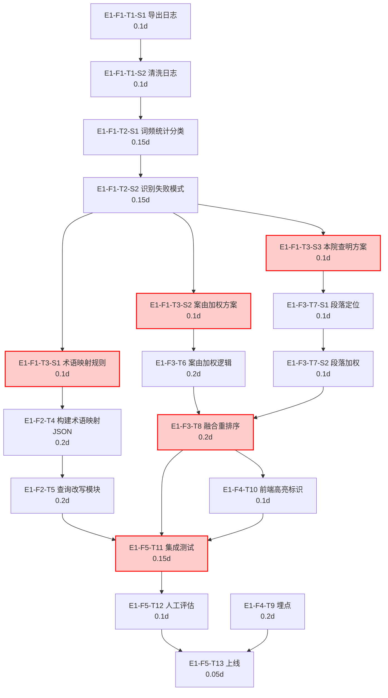

### 阶段一：WBS任务树与依赖图

#### 1. WBS任务分解（Epic → Feature → Task → Sub-task）

- **E1 检索结果高精准度优化**（Epic）
  - **F1 失败查询日志分析与优化方案设计**（Feature）
    - **T1 提取并清洗失败查询日志**
      - `E1-F1-T1-S1` 从数据库导出近一周失败查询记录
        - 工时：0.1天 | 置信度：中 | 前置：无
        - 交付物：原始日志CSV（≥50条记录）
        - 验收标准：导出字段完整（timestamp, raw_query, clicked_doc_id, session_id），无格式错误
      - `E1-F1-T1-S2` 数据清洗（去重、去噪、标准化）
        - 工时：0.1天 | 置信度：中 | 前置：E1-F1-T1-S1
        - 交付物：清洗后查询清单CSV
        - 验收标准：去除明显噪声（空查询、乱码），保留≥40条有效失败查询，查询文本规范化（全角半角、冗余空格）
    - **T2 失败模式聚类分析**
      - `E1-F1-T2-S1` 高频词统计与查询归类
        - 工时：0.15天 | 置信度：中 | 前置：E1-F1-T1-S2
        - 交付物：词频统计表与查询类别初步标签
        - 验收标准：统计出Top20高频法律术语，初步标签覆盖≥80%查询
      - `E1-F1-T2-S2` 识别Top5失败模式并给出根因假设
        - 工时：0.15天 | 置信度：中 | 前置：E1-F1-T2-S1
        - 交付物：失败模式分析报告（Markdown）
        - 验收标准：明确列出≥5种失败模式（如术语不匹配、案由缺失、段落忽略等），每种附≥2个真实查询示例和假设根因
    - **T3 制定优化策略文档**
      - `E1-F1-T3-S1` 设计法律术语映射规则与初始映射表
        - 工时：0.1天 | 置信度：高 | 前置：E1-F1-T2-S2
        - 交付物：术语映射规则草案（含10组高频映射样例）
        - 验收标准：规则说明触发条件、映射动作（替换/扩展），样例覆盖报告中Top5术语不匹配问题
      - `E1-F1-T3-S2` 设计案由字段加权方案
        - 工时：0.1天 | 置信度：高 | 前置：E1-F1-T2-S2
        - 交付物：案由加权方案说明（权重系数、匹配方式）
        - 验收标准：方案明确“案由”字段提取逻辑、匹配函数（精确/模糊）、加权分值范围（如0-1.5倍）
      - `E1-F1-T3-S3` 设计“本院查明”段落加权方案
        - 工时：0.1天 | 置信度：高 | 前置：E1-F1-T2-S2
        - 交付物：本院查明段落加权方案说明
        - 验收标准：定义段落定位规则（正则/关键词）、匹配度计算方式、与现有分数的融合策略
  - **F2 查询改写实现**（Feature）
    - **T4 构建法律术语映射表JSON**
      - 工时：0.2天 | 置信度：中 | 前置：E1-F1-T3-S1
      - 交付物：term_mapping.json（≥30组映射）
      - 验收标准：JSON格式有效，至少覆盖失败日志中高频术语不匹配的15组术语对，经人工抽查映射合理
    - **T5 实现查询改写模块**
      - 工时：0.2天 | 置信度：中 | 前置：E1-F2-T4
      - 交付物：query_rewriter.py 代码PR
      - 验收标准：单元测试通过——给定10个含术语的query，输出改写后query包含扩展词，且原始关键信息不丢失；100个随机query测试不抛异常
  - **F3 排序权重调整**（Feature）
    - **T6 实现案由字段加权逻辑**
      - 工时：0.2天 | 置信度：中 | 前置：E1-F1-T3-S2
      - 交付物：case_cause_booster.py 代码PR
      - 验收标准：单元测试——给定查询案由和文档案由，加权函数返回符合设计范围的加分值；集成测试草案可用
    - **T7 实现本院查明段落识别与加权**
      - `E1-F3-T7-S1` 实现“本院查明”段落定位函数
        - 工时：0.1天 | 置信度：低 | 前置：E1-F1-T3-S3
        - 交付物：paragraph_locator.py
        - 验收标准：对5份不同格式判决书样本，准确抽取出“本院查明”段落内容（准确率≥80%）
      - `E1-F3-T7-S2` 实现段落匹配度计算与加权
        - 工时：0.1天 | 置信度：低 | 前置：E1-F3-T7-S1
        - 交付物：paragraph_weighter.py
        - 验收标准：给定查询与识别出的段落，计算匹配得分，分数分布符合预期（匹配度高者得分高）
    - **T8 融合加权分数到LLM重排序**
      - 工时：0.2天 | 置信度：中 | 前置：E1-F3-T6, E1-F3-T7-S2
      - 交付物：rerank_fusion.py 代码PR
      - 验收标准：集成测试——输入10个查询及候选文档列表，排序输出中案由高度匹配且本院查明命中度高的文档排名相较基线前移；不破坏无匹配文档的原始相对序
  - **F4 埋点与前端适配**（Feature）
    - **T9 增加搜索点击及二次搜索埋点**
      - 工时：0.2天 | 置信度：高 | 前置：无（逻辑独立）
      - 交付物：前端埋点代码PR（搜索结果点击事件、二次搜索事件上报）
      - 验收标准：浏览器开发者工具中确认事件成功上报至数据平台，事件参数包含doc_id、position、query_session_id；二次搜索事件包含前次query
    - **T10 前端结果展示优化（可选）**
      - 工时：0.1天 | 置信度：高 | 前置：E1-F3-T8
      - 交付物：搜索结果卡片增加“本院查明”命中标识
      - 验收标准：视觉上可区分命中本院查明的文档（如小标签），不影响其他结果展示
  - **F5 测试、验收与上线**（Feature）
    - **T11 集成测试与回归测试**
      - 工时：0.15天 | 置信度：中 | 前置：E1-F2-T5, E1-F3-T8, E1-F4-T10
      - 交付物：测试报告（含新旧版本对比截图）
      - 验收标准：覆盖≥20个典型查询（包含失败日志中的问题查询），新版Top5结果中相关类案命中数较旧版有提升；现有关键词检索用户流无退化（回归通过）
    - **T12 预发布环境人工评估**
      - 工时：0.1天 | 置信度：高 | 前置：E1-F5-T11
      - 交付物：人工评估记录表（10个查询的新旧对比）
      - 验收标准：≥7/10查询的新版Top3结果中至少命中1个高度相似类案，且没有出现严重错位（显著相关文档被挤出Top10）
    - **T13 生产上线及回滚配置**
      - 工时：0.05天 | 置信度：高 | 前置：E1-F5-T12, E1-F4-T9
      - 交付物：上线部署、功能开关配置、回滚操作手册
      - 验收标准：上线后5分钟内服务可正常访问；执行回滚脚本后能在1分钟内恢复至上线前版本，旧功能无影响

**关键路径说明**：由于仅1名全栈工程师，所有任务实际为串行执行，任务总工时之和即为项目最短工期（2.4人天）。逻辑依赖图中耗时最长的依赖链为 T1→T2→T3→T6→T7→T8→T10→T11→T12→T13（1.6天），其他任务（T4、T5、T9）可在该链间隙执行而不延长总工期，但因资源独占，整体工期仍为2.4天。因此，**所有任务均在关键路径上**。

#### 2. Mermaid 依赖流程图

---

### 阶段二：依赖链脆弱性分析

#### 1. 级联延迟模拟（假设单人串行，延迟直接顺延所有后继任务）

| 被延迟任务             | 延迟3天模拟             | 依次受影响的后续任务                                         | 对总工期的影响                                  |
| ---------------------- | ----------------------- | ------------------------------------------------------------ | ----------------------------------------------- |
| **T3（优化策略文档）** | T3-S1/S2/S3 任一延迟3天 | T4→T5、T6、T7→T8→T10→T11→T12→T13、T9→T13 全部推迟3天开始     | 总工期增加3天，由2.4天变为5.4天，Sprint彻底失败 |
| **T8（融合重排序）**   | T8延迟3天               | T10→T11→T12→T13 顺延3天（T9不受T8直接影响，但T13需T9，仍有影响） | 总工期增加3天，致命                             |
| **T11（集成测试）**    | T11延迟3天              | T12→T13 顺延3天，所有上线工作停滞                            | 总工期增加3天，致命                             |

**结论**：在单人资源下，任何处于汇聚点或中后期的任务延迟，都会以1:1的比例传递至终点。3天缓冲完全不足以吸收这种延迟，项目必须极度压缩范围或提前准备降级。

#### 2. 单点瓶颈识别

以下任务被≥3个后继任务逻辑依赖，且单人环境下不存在“并行替代方案”，是项目的阿喀琉斯之踵：

- **T3（优化策略文档）**：被 T4（术语映射）、T6（案由加权）、T7（本院查明加权）同时依赖。一旦T3的方案设计有缺陷或返工，三个实现分支全部停滞，造成全局阻塞。加之人力唯一，返工期间无任何进展。
- **T8（融合重排序）**：被 T10（前端高亮）、T11（集成测试）依赖，且T11又被T12、T13依赖。T8是技术集成的咽喉，一旦加权融合逻辑出错，直接阻断测试与上线。
- **T11（集成测试）**：汇聚了查询改写（T5）、重排序（T8）、前端（T10）三条产出，且是上线前的唯一验证闸门。单人下无独立测试角色，测试本身就是开发者的自测，极易因“开发者盲区”遗留问题，导致评估（T12）和上线（T13）风险剧增。

**特别警示**：由于所有任务本质上串行，上述单点的任何阻塞都会“冻结”整个工程师的全部产出，没有第二人可以抢救其它并行任务。

#### 3. 依赖类型分类与风险评级

| 依赖类型           | 代表依赖关系                                                 | 风险等级             | 说明                                                         |
| ------------------ | ------------------------------------------------------------ | -------------------- | ------------------------------------------------------------ |
| **FS (完成-开始)** | 绝大多数依赖链，如 T3→T4, T6→T8, T11→T12                     | **高**               | FS是默认依赖，但结合单人串行，FS使得任一前置任务的任何工期膨胀或质量缺陷都直接推迟后继，无缓冲吸收。 |
| **SS (开始-开始)** | 无真正SS。理论可并行的 T4、T6、T7 因资源独占变成隐性FS。     | **极高**（隐性风险） | 原本可降低风险的并行潜能被资源约束扼杀，导致项目对单点故障极其敏感。 |
| **FF (完成-完成)** | 无。T13上线需 T12（评估完成）与 T9（埋点完成）同时就绪，本质是多个FS汇聚。 | **中**               | 汇聚点容易因任何一支延迟而整体延期，但因所有任务终将由同一人完成，不如资源瓶颈严重。 |

#### 4. 最坏情况延迟链

假设每个任务按最悲观工期完成（考虑日志质量差、术语映射返工、本院查明段落提取准确率不达预期、集成bug等），悲观工期估算如下：

| 任务            | 悲观工期（天） | 延迟原因                                   |
| --------------- | -------------- | ------------------------------------------ |
| T1 日志提取清洗 | 0.4            | 日志散落、大量噪声需手动处理               |
| T2 失败模式分析 | 0.5            | 查询过于简略，归类困难                     |
| T3 优化策略文档 | 0.5            | 返工风险（策略不可行或评估数据不足）       |
| T4 术语映射表   | 0.3            | 法律术语专业性强，收集覆盖不足需临时增补   |
| T5 查询改写模块 | 0.4            | 改写后语义保真度验证需额外调试             |
| T6 案由加权     | 0.3            | 案由提取逻辑需适配多种写法                 |
| T7 本院查明加权 | 0.5            | 段落定位准确率低（格式多样），匹配调优耗时 |
| T8 融合重排序   | 0.4            | 多权重融合，平衡调参需多次实验             |
| T9 埋点         | 0.2            | 前端埋点测试环境配置可能耽搁               |
| T10 前端高亮    | 0.1            | 简单，悲观仍为0.1                          |
| T11 集成测试    | 0.3            | 发现意外回归问题，修复与复测               |
| T12 人工评估    | 0.3            | 若效果不达预期需紧急调整权重再评估         |
| T13 上线        | 0.05           | 上线操作本身风险低                         |

**最悲观链总工期**：0.4+0.5+0.5+0.3+0.4+0.3+0.5+0.4+0.2+0.1+0.3+0.3+0.05 = **4.25人天**。

该工期远超Sprint的3天上限，也远超2.4人天的80%缓冲阈值。即便不考虑缓冲，最大可用3人天也无法容纳。

**降级方案**（保证核心可感知提升，砍掉高风险/高不确定任务）：
1. **砍掉 T7 本院查明加权**（悲观0.5天，且段落定位技术不确定性高，置信度低）—— 仅保留案由加权和术语映射。
2. **砍掉 T10 前端高亮标识**（0.1天）—— 由埋点数据间接推断改善，无需前端展示。
3. **精简 T4 术语映射表**（降为0.15天）—— 只收录日志中Top10高频术语不匹配对，快速构造最小可用映射。
4. **T9 埋点简化**：复用现有埋点基础设施，仅增加两个关键事件（搜索结果点击、二次搜索），不涉及新平台接入。
5. **T12 人工评估降级为快速自评**（0.1天）：使用5个典型查询快速A/B对比，不做详细记录。

降级后精简任务集与悲观工期：
T1(0.3) + T2(0.4) + T3(0.3精简策略) + T4(0.15) + T5(0.3) + T6(0.25) + T8(0.3) + T9(0.15) + T11(0.2) + T12(0.1) + T13(0.05) ≈ **2.5人天**，仍略高于2.4缓冲，但可通过极端压缩T2分析深度（仅做粗分类）降至2.3天左右，可勉强容纳。

---

### 阶段三：高风险任务清单

| 任务编号  | 任务名                  | 风险类型                                         | 风险描述                                                     | 如果延迟，一级影响                           | 如果延迟，二级影响                           | 缓解方案                                                     |
| --------- | ----------------------- | ------------------------------------------------ | ------------------------------------------------------------ | -------------------------------------------- | -------------------------------------------- | ------------------------------------------------------------ |
| E1-F1-T3  | 制定优化策略文档        | 依赖过多（被3个任务依赖）、关键人依赖            | 策略设计错误或数据不足导致返工，T4/T6/T7全部停滞             | 三个实现分支（术语、案由、本院查明）同时停工 | 集成测试无法开始，项目直接延误               | 基于Top失败模式先确定1-2个确定性最强的策略，其余标记为“如果时间允许”；策略文档设置硬性时间盒（0.3天），超时即冻结，按最小可行策略进入开发 |
| E1-F3-T8  | 融合加权分数到LLM重排序 | 技术不确定性高、依赖过多（被2个重要任务依赖）    | 多权重融合可能破坏原有排序质量，需要反复调参；逻辑上承上启下，一旦出错前端和测试受阻 | T10、T11无法开始                             | T12评估无法进行，不能上线                    | 保留原有重排序作为基线，加权融合采用简单线性加分并设置上限，避免毁灭性排序；增加快速A/B验证脚本，早发现早调 |
| E1-F3-T7  | 本院查明段落识别与加权  | 技术不确定性高（法律文书格式多样）、工时置信度低 | 段落定位准确率可能极低（<60%），投入大量时间调优但不见效     | 如果未砍掉，将消耗宝贵人天，挤压测试时间     | 影响整体优化效果，若效果不显著则无法达成指标 | **强烈建议降级为可选或直接砍掉**。若非做不可，先用正则匹配80%文书，放弃剩余格式，严格控制0.2天时间盒，到期未达准确率即回退此特性 |
| E1-F1-T1  | 提取并清洗失败查询日志  | 工时置信度低（日志质量未知）                     | 失败日志可能缺乏用户行为闭环（无点击数据），难以定义“失败”；日志量过少（<20条） | 后续分析无法得到可靠失败模式                 | 优化策略缺乏数据支撑，变成盲调               | 提前与数据平台确认日志字段和量级；若日志质量太差，改用“高频零点击query”作为替代分析对象；时间盒0.3天，到期即用已有样本强行出方案 |
| E1-F5-T11 | 集成测试与回归测试      | 关键人依赖、需求可能变更                         | 单人自测易遗漏回归缺陷，且一旦发现严重问题，修复会挤压后续所有环节 | T12评估推迟                                  | 上线延期                                     | 准备自动化回归脚本（复用现有接口测试）；测试用例优先覆盖现有关键词检索流，确保不退化；设定测试时间盒，发现非阻断性bug记录但不修复（除非致命） |
| E1-F4-T9  | 埋点增加                | 需求可能变更                                     | 若“自然语言检索”被重新评估为更紧迫的Must-have，埋点可能需支持新的查询改写事件，导致返工 | 埋点范围变化，增加工作量                     | 可能延迟T13上线                              | 埋点设计采用通用事件参数，预留扩展字段，避免硬编码特定改写类型；保持与产品快速对齐 |

**总体结论**：本次迭代在单人、短周期、高不确定性下，极度脆弱。核心生存法则为“砍掉一切不确定的，只留确定可感知提升的”——集中火力于术语映射和案由加权两项高置信度优化，将本院查明段落加权、前端优化列为第一降级候选；同时设置严格时间盒，到点即冻结，防止完美主义拖垮Sprint。