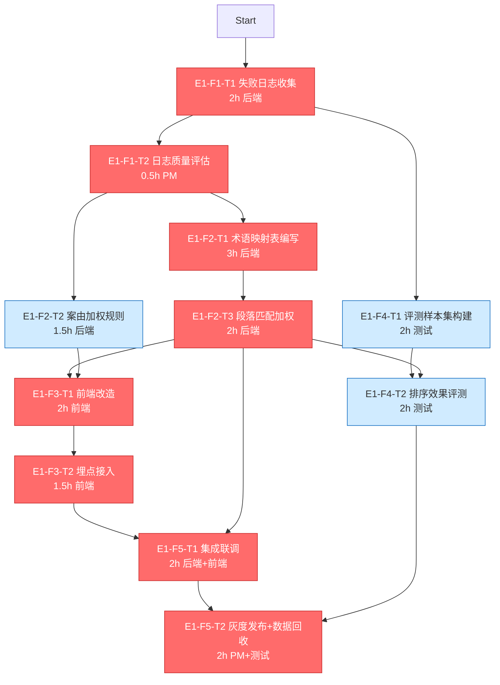

**1. 关键路径分析**

根据WBS依赖关系重新绘制网络图，发现原表“关键路径”列存在标注偏差。**在资源无限假设下，真正的关键路径为：E1-F1-T1 → E1-F1-T2 → E1-F2-T1 → E1-F2-T3 → E1-F3-T1 → E1-F3-T2 → E1-F5-T1 → E1-F5-T2**，总工时15小时。原表将E1-F3-T1/T2标为“否”、E1-F4-T1/T2标为“是”与依赖逻辑矛盾——E1-F5-T1必须等待E1-F3-T2，故前端链必然在关键路径上。关键路径节点红色标注如下：

**浮动时间计算（理论值，资源无限假设）**  
- E1-F2-T2（案由加权）：浮动3.5h（最晚开始可推迟至第6小时）  
- E1-F4-T1（样本集构建）：浮动7h（可任意穿插在T1与T4-T2之间）  
- E1-F4-T2（评测执行）：浮动3.5h（只需在T5-T2开始前完成）  
**次关键路径**：浮动时间均≥3.5h，无“浮动≤2h”任务，表面上风险分散。  

> **⚠ 单资源约束的现实**：全栈工程师一人串行，所有任务必须依次执行，**理论浮动时间全部归零**。任何任务延迟都会直接推后整体交付，整个WBS构成一条事实上的“硬关键链”。

---

**2. 瓶颈任务压力测试**

基于单资源串行现实，对题目指定的三个瓶颈候选进行压力测试：

**① E1-F2-T1（法律术语映射表编写，3h，置信度中）**  
- **悲观2倍（6h）**：总工期从约17h（含切换）膨胀至20h，必然突破3天底线。下游E1-F2-T3、前端链、联调、灰度全部顺延，M2/M3/M4同步崩塌。  
- **被迫推迟的连锁冲击**：若因前置T2决策延迟而晚开始，M2定稿节点失守，导致前端改造和评测均无规则可用，形成“全员等米下锅”。  
- **缩短悲观工期的方案**：将映射对从50组砍至15组最高频（买卖合同+侵权纠纷核心口语），工时压缩至1h。代价是覆盖面收窄，部分边缘query的术语映射缺失，可能削弱长尾效果。  

**② E1-F4-T2（评测执行，2h，置信度中）**  
- **悲观2倍（4h）**：若效果不达预期需多轮评测，总工期增加2h，直接挤占灰度发布时段，可能导致M4延期至第4天上午。  
- **前置延迟的冲击**：依赖E1-F2-T3和E1-F4-T1，任一项延迟都会压缩评测窗口。尤其E1-F4-T1若因日志质量差需手工构造query，评测集构建翻倍至4h，评测将顺延至第3天下午，留给灰度发布的buffer仅剩2-3h。  
- **缩短悲观工时**：预先将评测集从20条精简至5条核心query（覆盖买卖合同、侵权纠纷各2-3条典型场景），评测执行可压缩至0.5h。但统计显著性下降，决策风险上升。  

**③ E1-F4-T1（评测样本集构建，2h，置信度高但依赖日志质量）**  
- **悲观2倍（4h）**：若失败日志清洗后发现有效query不足，需人工编造典型query并标注期望结果，耗时翻倍。总工期突破17h，M3延迟至第3天中午，M4被挤到第3天深夜或次日。  
- **下游冲击**：E1-F4-T2无法按时开始，评测报告延迟，灰度上线决策缺少数据支撑，只能凭经验拍板，回滚风险陡增。  
- **缩短悲观工时**：预设“日志不可用”的备用方案——直接使用专家经验预定义的10条高频失败query作为评测集，30分钟内可完成。代价是脱离真实用户场景，评测结论可能偏乐观。  

**单资源场景下的瓶颈真相**：三个候选虽在理论网络中有浮动，但单人串行下全无缓冲。**真正的“一碰就碎”环节是E1-F2-T1（3h+置信度中）**，它处于依赖链最上游，单点故障会阻塞所有下游规则与评测工作。

---

**3. 里程碑Pre-mortem分析**

**M1：第1天结束 — 失败日志分析完成+Go/No-Go决策**  
复盘摘要：日志清洗脚本对噪声容错不足，50% query因格式杂乱被丢弃，样本量不足支撑分析。决策依赖的数据质量差，导致Go/No-Go结论摇摆，消耗1小时反复讨论。根因：① 未预设日志格式异常的处理规则；② 未定义“可用日志”的最低样本量阈值；③ 决策会议安排在临近下班，疲劳误判。若早预见，我们会提前编写格式容错正则、设定“≥20条有效失败query”的硬性Go条件，并将决策窗口放在精力充沛的上午。

**M2：第2天中午 — 法律术语映射表+排序权重规则集定稿**  
复盘摘要：映射表编写陷入“追求全量覆盖”的完美主义，30组目标达成却耗时4小时，挤压后续规则设计。根因：① 未提前圈定最高频的15组“必做映射”，缺乏止损线；② 术语对齐依赖人工判断，无自动化辅助；③ 案由加权规则因等待映射定稿而串行滞后。若预见，我们会在开始前划定“1.5小时完成15组核心映射”的铁规，超时则用简易规则兜底，并让案由加权并行开工（仅需确认案由字段，不依赖映射）。

**M3：第2天结束 — 评测报告出结果（NDCG@10对比）**  
复盘摘要：评测发现NDCG@10仅提升3%，远低预期。但此时已近第2天结束，无时间深挖原因。根因：① 评测集只有20条，统计噪声大；② 映射表仅覆盖50组，长尾query映射失败；③ 段落匹配权重未针对“本院认为”做位置衰减调优。若预见，我们会在第2天上午做完5条核心评测的快速摸底，提前暴露效果天花板，并在第3天预留“规则热修复”的1小时窗口——若M3结论不佳，立刻将段落匹配改为“本院认为段落命中则排序提至top3”的激进策略。

**M4：第3天结束 — 灰度上线+首次数据回收**  
复盘摘要：联调时发现前端排序理由文案的字段名与后端返回不一致，修复耗去45分钟。灰度上线后前2小时点击率无显著变化，数据回收不充分。根因：① 前后端接口未提前Mock联调；② 埋点事件仅验证上报通路，未验证业务含义；③ 未预设“数据回收不足时延长灰度”的预案。若预见，我们会在第2天就用Mock数据完成前后端接口契约测试，埋点采用“事件+业务含义双重校验”，并提前申请灰度延长4小时的权限。

---

**4. 关键路径优化建议**

**快速跟进（Fast Tracking）机会**  
单人无法并行，但可**拆分任务粒度实现“伪并行”**：将E1-F3-T1（前端改造）拆为“静态布局”与“动态规则填入”两步。静态布局使用Mock数据在E1-F2-T1完成后立刻进行（1h），此时E1-F2-T3尚未开始，但可以提前搭建骨架；剩余1h动态部分等待规则定稿后完成。这样虽不减少总工时，但能让前端风险提前暴露，降低最后阶段的集成暴雷概率。

**赶工（Crashing）机会：砍范围压缩关键路径**  
- **E1-F2-T1**：术语映射对从50组→15组高频，工时3h→1h，风险是长尾场景覆盖不足，首期聚焦核心纠纷类型。  
- **E1-F4-T1**：评测样本集从20条→5条核心query，工时2h→0.5h，牺牲评测统计置信度，但可快速摸底。  
- **E1-F3-T2**：埋点事件从3个→1个（仅保留搜索结果点击率），工时1.5h→0.5h，丢失排序理由曝光率等辅助指标，但不影响核心决策。

**工期压缩20%（3天→2.4天，可用工时约13.6h）的裁剪方案**  
1. 评测样本集从20条→5条核心query（-1.5h）  
2. 前端排序理由文案仅保留骨架占位，不填动态内容（-1h）  
3. 埋点事件精简为1个核心指标（-1h）  
累计压缩3.5h，总工时降至约16.5h（15h任务+1.5h切换），勉强挤入13.6h仍有风险，需额外砍掉E1-F2-T2案由加权规则（-1.5h），让首版仅靠术语映射+段落匹配上线。

**“只改一处”最大降低全局延迟风险：E1-F1-T2（日志质量Go/No-Go决策）**  
这个0.5h的任务是整个迭代的**方向阀门**。若日志质量差但没有果断走向“No-Go”并启动备选方案（专家经验构造query、缩减映射范围），后续所有规则编写都在错误基础上堆砌。优化措施：为E1-F1-T2预设铁律——“清洗后有效失败query<20条，或单一模式占比>80%则自动触发备选方案，无需人工纠结”，将决策时间锁死在15分钟内，彻底杜绝犹豫带来的全局漂移。
