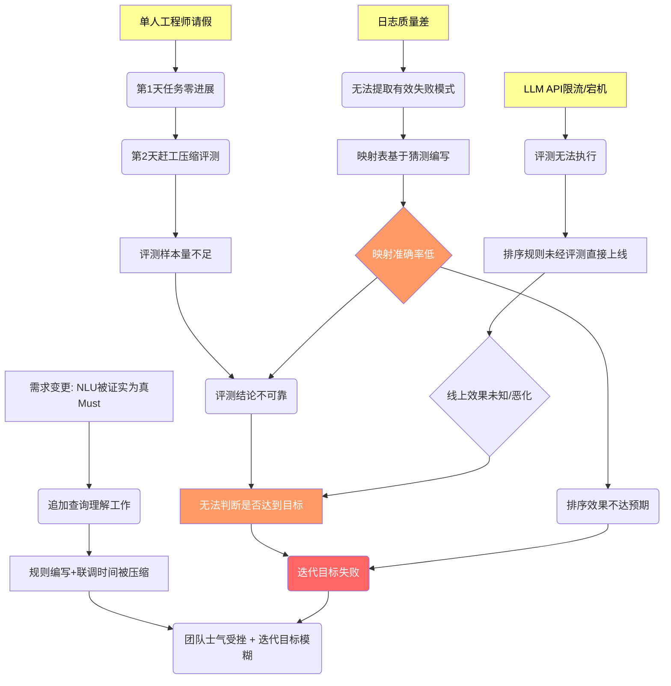

# 类案检索RAG助手 Sprint 风险识别与Pre-mortem分析报告

## 1. 五维度风险扫描

### 技术风险
- **法律术语映射准确率不可控**：口语→法言法语的映射质量完全取决于全栈工程师的法律领域知识深度。若缺乏法律背景，“一个人开车碰瓷被行车记录仪拍下来了”可能错误映射到“交通事故责任纠纷”而非“故意制造事故/诈骗罪”。不确定性来源：领域知识。
- **嵌入模型对法律白话的理解能力未经验证**：通用嵌入模型可能在“在职期间就开始动手脚”这类口语化案情描述上产生理解偏差，直接导致向量检索返回无关案例。不确定性来源：模型能力边界。
- **排序权重调整缺乏完整AB/回滚机制**：规则型优化需要分钟级回滚能力。若上线后效果反而下降（如过度加权案由压制了真正相关但案由不同的案例），缺乏快速回滚将造成持续负面影响。不确定性来源：工程健壮性。

### 人员风险
- **关键人依赖（唯一工程师请假/生病）**：整个项目仅1名全栈工程师，无备选人力。若该工程师在第1天请假，E1-F1-T1（日志分析）和E1-F2-T1（映射表编写）直接阻塞，所有后续任务无法启动，迭代整体推迟。
- **技能缺口（法律评测方法论）**：全栈工程师可能缺乏法律领域的评测经验（NDCG@10、法律相关度判断），导致评测集构建和评测结论可靠性存疑。
- **单人疲劳决策**：同一人在3天内连续切换四个角色，第3天下午的灰度上线决策可能因疲劳而做出过于乐观或过于保守的判断。

### 依赖风险
- **失败查询日志质量不可控**：这是整个迭代的“原材料”。若日志中query过于简略（如仅“合同纠纷”三字）或缺乏用户行为反馈（无法判断最终是否找到想要的结果），日志分析将无法提取有效失败模式。
- **基础设施（嵌入模型/LLM/向量数据库）稳定性**：若第三方API在迭代期间出现限流或宕机，评测执行（E1-F4-T2）和需要LLM辅助验证映射对质量的任务（E1-F2-T1）将直接受阻。
- **法律数据库（裁判文书）覆盖不完整**：若数据库本身缺少某些案由的裁判文书，即使排序再精准也无法返回结果，用户会将“数据库不全”误判为“检索不准”。

### 需求风险
- **MoSCoW预判：自然语言案情检索可能被低估为Should而非Must**：若本次精准度工作不包含查询理解（NLU）改进，排序权重调整可能建立在错误的理解之上——在错误的方向上排出“更相关”的错误结果。需求变更可能在评测阶段被触发。
- **“可感知提升”定义模糊**：目标“点击率提升15%”是量化指标，但若用户点击后发现内容不相关，点击率提升可能虚高。需求可能变更为“增加用户停留时长或收藏率作为补充指标”。
- **竞品MetaLaw功能迭代速度未知**：若MetaLaw在本次迭代期间发布重大更新（更强语义理解或更全数据库），对标差异化策略需重新评估。

### 时间风险
- **总工时严重超载**：单角色任务总工时约22.5小时，超过14.4小时缓冲阈值8.1小时，即使最乐观估算也需裁切至少35%任务范围。
- **悲观工期雪崩**：若各任务按悲观估算（日志分析4h、映射表6h、评测4h、联调4h），总悲观工期约36小时，是可用工时的2.5倍，溢出超100%。
- **关键路径上的中断**：第2天下午1小时评审会若延长或产生额外TODO，将进一步压缩开发时间；角色切换损耗最坏情况（每天切换3次以上）累计可达1.5小时，相当于一个完整任务的工时。

## 2. 三维风险矩阵

| 风险名称                 | 维度      | 概率 | 影响 | 可检测性 | 综合等级 | 最早触发信号                                 | 检测方式                                        |
| ------------------------ | --------- | ---- | ---- | -------- | -------- | -------------------------------------------- | ----------------------------------------------- |
| 法律术语映射准确率低     | 技术/人员 | 高   | 高   | 低       | **极高** | 映射表编写时对口语案情无从下手               | 仅到评测阶段才能通过NDCG暴露，第1天几乎无法检测 |
| 失败查询日志质量差       | 依赖      | 中   | 极高 | 高       | **高**   | 第1天上午打开日志文件发现query过于简略       | 日志分析任务E1-F1-T1完成后即可判断              |
| 单人工程师请假/生病      | 人员      | 低   | 极高 | 高       | **高**   | 开工前/期间突然通知                          | 即时可见，但不可控                              |
| 总工时超载导致交付不完整 | 时间      | 极高 | 高   | 中       | **极高** | 第1天下午任务进度落后计划>30%                | 每日站会进度跟踪                                |
| LLM API限流/宕机         | 依赖      | 中   | 高   | 中       | **高**   | API调用返回429/503错误                       | 实时监控API状态码                               |
| 嵌入模型理解偏差         | 技术      | 中   | 高   | 低       | **高**   | 评测时发现高相关文档排名持续靠后             | 评测执行阶段NDCG显著低于基线                    |
| 需求变更（NLU成为瓶颈）  | 需求      | 中   | 高   | 中       | **中**   | 评测显示排序改善不明显，分析指向查询理解问题 | 评测结果与根因分析                              |
| 点击率虚高（无效点击）   | 需求      | 低   | 中   | 低       | **中**   | 上线后点击率上升但停留时长/收藏率下降        | 数据回收时交叉分析多个指标                      |
| 角色切换过度损耗         | 时间      | 极高 | 中   | 高       | **高**   | 每次切换后需15-20分钟恢复上下文              | 工作日志记录                                    |

**综合等级说明**：极高＝大概率发生且影响严重且难以早期发现；高＝至少两个维度处于不利水平。

## 3. 高等级风险Pre-mortem

### 风险1：法律术语映射准确率低（综合等级：极高）
*假设Sprint结束时，映射准确率低已造成实际损失——Sprint Review上我们讲述：排序效果不升反降，用户搜索“碰瓷”仍看到交通事故赔偿案例。失败源于三个关键决策：①第1天未找执业律师做半小时映射对抽检；②第2天过度依赖工程师常识编写映射表而未用LLM交叉校验；③第3天抱着侥幸心理上线，未设置“若NDCG无提升则自动回滚”的硬止损线。若第1天前3小时就意识到此风险，我们会先花1小时请王律抽检20条口语query的映射质量，再用1小时建立“映射对必须通过LLM+法律词典双重验证”的门禁，最后1小时只针对通过验证的映射对设计权重规则。*

### 风险2：总工时超载导致交付不完整（综合等级：极高）
*假设Sprint结束时，工时超载导致交付残缺——Sprint Review上我们承认：灰度上线未完成，评测只跑了8条样本。失败决策链：①第1天试图坚持完整WBS，未做任何任务裁切；②第2天明知进度落后30%仍拒绝砍掉前端展示改动；③第3天把最后2小时用于修复非阻断性UI bug而非保核心上线。若第1天前3小时就直面超载事实，我们会立即执行“MoSCoW硬裁切”：砍掉段落匹配加权规则中的2个低频案由（省2h），将评测样本从20条降至15条（省0.5h），并将前端调整降级为“仅日志记录不展示”（省1.5h），确保核心链路（日志→映射表→核心规则→评测→上线）在14h内闭合。*

### 风险3：失败查询日志质量差（综合等级：高）
*假设Sprint结束时，日志质量差导致方向性失败——Sprint Review上我们展示：基于7条有效query设计的权重规则，上线后对95%的查询无效果。关键错误：①第1天Go/No-Go决策时因“没有Plan B”而强行放行低质量日志；②第2天明知只有7条query可用，仍坚持“数据驱动”而非切换至专家经验+兜底映射对；③未利用评审会机会向律师收集10条典型失败查询作为补救样本。若第1天前3小时就预见此局，我们会：第1小时做日志质量硬评判（≥15条有效失败query才算Go），若不达标则立即启动“专家映射对兜底方案”；第2小时整理王律提供的20条历史失败查询；第3小时基于这20条+15组兜底映射对直接进入映射表编写，完全绕过日志分析。*

## 4. 风险联动链分析

**最高风险传导路径**（粗线标识）：  
**日志质量差 → 映射表数据驱动失效 → 映射准确率低 → 排序效果不达预期 → 评测结论“不显著” → 无法按期上线 → 迭代目标失败**  
此路径贯穿所有维度，且中间节点（映射准确率低）可检测性极低，一旦进入链条，到评测阶段才暴露，已无补救时间。

## 5. 分阶段应急预算建议

### 前置准备（Day 0，迭代开始前）
1. **日志预筛查（1h）**：提前打开失败查询日志，判断是否存在≥15个可识别的高频失败模式。若不足15个，立即启动“专家兜底方案”。
2. **兜底映射对准备**：基于常识和王律提供的20条典型查询，预先编写15组高置信度映射对（如“不发货→迟延交付/根本违约”、“碰瓷→故意制造事故”、“在职期间动手脚→职务侵占/盗窃”），作为日志不可用时的Plan B。
3. **基础设施健康检查**：确认嵌入模型、LLM API、向量数据库的可用性和限流阈值，提前申请提额或准备备用endpoint。

### 第1天结束：正式Go/No-Go决策点
- **Go条件**：日志中可提取≥15个有效失败模式，且其中≥10个能映射到明确的法律术语。
- **No-Go行动**：若日志质量不达标，立刻切换至“兜底映射对+专家规则”方案，跳过剩余日志分析工作，将节约的2h重新分配给映射表编写与评测集构建。
- **硬止损线**：无论Go/No-Go，第1天必须完成映射表初稿的50%以上，否则触发第2天强制裁切。

### 第2天结束：评测门禁
- **NDCG@10硬指标**：若评测结果NDCG@10相比基线无提升（或低于0.02），禁止进入第3天上线流程，转为根因分析和规则迭代。
- **自动回滚预案就绪**：确保排序权重配置支持一键回滚至基线版本，上线前完成一次回滚演练。

### 第3天：缓冲黑匣子
- 预留最后**2小时**作为救火缓冲，明确其用途顺序：
  1. 优先补救任何导致无法上线的阻断性Bug；
  2. 其次补充评测样本（若前序样本<15条）；
  3. 最后才可用于前端展示优化。
- **上线判定**：第3天下午4点（结束前2小时）做最终上线决策，若核心指标（点击率跟踪埋点、排序服务稳定性）未达标，中止上线，冲刺目标调整为“完成离线评测报告并为下个迭代输出明确改进方向”。

### 关键人风险应急
- **请假应急预案**：若工程师第1天请假，立即将本次迭代目标从“灰度上线”降级为“离线评测报告”，第2-3天集中完成日志分析+映射表编写+离线评测，上线推迟至下个迭代。
- **技能缺口补偿**：第1天安排30分钟与王律（领域专家）的快速对齐会，确认10组评测query的标准答案（相关案例ID），降低评测主观偏差。
